<p align="center">
  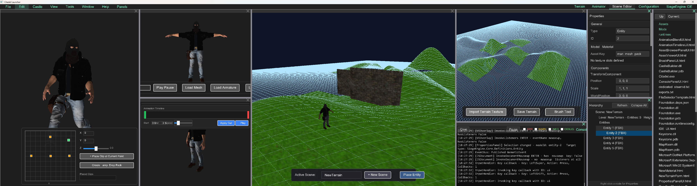
</p>

# RealmFoundry (repository: Castle)

SiegeEngine is the runtime. Castle is the self-hosting IDE built on that same runtime. The editor is not a second product sitting beside the engine.

## Documentation

| Doc | What it covers |
|---|---|
| [Architecture](docs/ARCHITECTURE.md) | Layers, self-hosting, frame loop, examples repo |
| [Rendering](docs/RENDERING.md) | `IRenderContext`, constant buffers, OpenGL-only backend |
| [Scenes and projects](docs/SCENES_AND_PROJECTS.md) | `SceneRegistry`, `ScriptLoader`, hosted preview, Play / Export |
| [IDE](docs/IDE.md) | Blades, docking, CastleBuilder / Keystone / ToolChest |
| [Boundaries](docs/BOUNDARIES.md) | Core vs IDE vs Server vs project scripts |

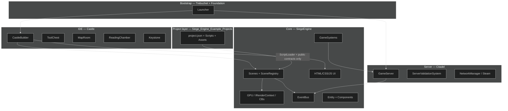

## Project Overview

RealmFoundry is an ambitious, open-source C#-based game engine and Integrated Development Environment (IDE) hybrid, designed to democratize the creation and playing of custom 3D video games, with a strong emphasis on real-time multiplayer experiences supporting hundreds of players. Drawing inspiration from tools like Unity, Godot, RPG Maker, and multiplayer engines, it transforms game development into a rewarding "meta-game" where creators—solo hobbyists, small teams, or larger communities—can build, mod, share, and collaborate on content without facing steep learning curves, mod conflicts, or inadequate multiplayer support. The engine prioritizes intuitive workflows, seamless previews, and instant testing, making the act of creation as engaging as gameplay itself. At its core, RealmFoundry functions as a professional-grade game creator tool: modular, extensible, and secure, rather than a prototype lacking robust editor features.

### Main Goals

The primary objectives of RealmFoundry are multifaceted, focusing on accessibility, collaboration, and scalability:

* **Empower Creators**: Enable non-professional developers to craft immersive MMORPG-style games with custom events (e.g., dialogues, shops, quests) using drag-and-drop interfaces, visual scripting, and asset importers. The IDE leverages the engine's own systems (e.g., rendering pipeline, event bus) for self-modifiability, allowing users to customize the tool itself via mods.
* **Seamless Multiplayer Integration**: Support dedicated servers, P2P, and solo modes out-of-the-box, with built-in anti-cheat mechanisms to ensure fair play. This includes real-time synchronization for hundreds of players, optimized bandwidth via entity deltas, and future expansions to multi-user IDE sessions where collaborators can edit shared projects as if in a multiplayer game.
* **Modding and Sharing Ecosystem**: Facilitate easy mod creation and distribution through JSON configs, Steam Workshop integration, and modular DLLs. Mods can extend UI, add blueprints (e.g., 2D/3D starters like FPS or isometric views), or introduce new mechanics without conflicts, fostering community-driven content.
* **Cross-Purpose Foundation**: Build a unified codebase where the engine powers both runtime gameplay and IDE tools, ensuring consistency and reusability. This allows for popping out panels into independent windows, dynamic loading of modules, and using game systems (e.g., physics, lighting) within editor previews.
* **Performance and Scalability**: Optimize for large-scale worlds with spatial grids, frustum culling, and occlusion checks, while maintaining cross-platform potential (Windows primary, with abstractions for Mac/Linux via OpenGL/Vulkan).
* **Community and Governance**: Incorporate features like server rulesets (ThroneRoom), social lobbies (GuildTower), and governance tools to manage collaborative projects, promoting inclusive development.

By achieving these goals, RealmFoundry aims to bridge the gap between simple game makers and full engines, creating a "Citadel" of creativity where users build virtual realms collaboratively and securely.

## Key Concepts

### Security

Security is a foundational pillar in RealmFoundry, especially given its multiplayer focus and moddable nature. The engine employs an authoritative server model (via GameServer.cs) to prevent cheating:

* **Validation Mechanisms**: All client actions (e.g., movement, inventory changes, combat) are validated server-side using ServerValidationSystem.cs. This includes speed/distance checks (e.g., maxSpeed=20f, maxDistance=20f), frustum-based visibility to limit data exposure, and occlusion checks to simulate realistic line-of-sight, reducing exploits like wall-hacks.
* **Protected Events**: EventBus.cs uses \[ProtectedEventAttribute] to restrict publishing of sensitive events to internal callers (e.g., Citadel namespace), preventing modders or clients from injecting unauthorized actions.
* **Networked Event Sync**: Only non-protected events are networked via SteamEngine, with serialization/deserialization ensuring data integrity. Input events (MouseInputEvent, KeyInputEvent) are validated before publishing.
* **Mod Security**: ModManager.cs whitelists hooks and scans mods for safe loading; future plans include sandboxing DLLs to prevent malicious code. Workshop items are fetched via Steam SDK, leveraging Valve's moderation.
* **Anti-Cheat Optimizations**: Spatial grids and delta tracking minimize unnecessary data transmission, while raytracing for sounds/physics adds layers of server-side simulation to detect anomalies.

This approach ensures a secure environment for multiplayer games and collaborative editing, minimizing risks in shared IDE sessions.

### Modularity

RealmFoundry's architecture is highly modular to support extensibility and avoid monolithic code:

* **DLL-Based Modules**: Specialized features (e.g., MapRoom.dll for level editing, ScriptChamber.dll for VS Code integration, QuestHall.dll for node-based quests) are loadable DLLs. ModManager.cs can be extended with Assembly.LoadFrom for dynamic resolution, allowing mods to add or override panels.
* **Abstractions and interfaces**: `IGameServer`, `IRenderContext` (OpenGL implemented; DirectX/Vulkan are future backends against the same interface, not present), `IControlContext`, `IScene`, `IHostedContent`. Dockable windows are `BasePanel` with Init/Update/Render/Dispose and a dock state.
* **Event-Driven Design**: EventBus.cs decouples systems via strongly-typed IEvents, supporting networked sync and mod injections (e.g., custom events from mods).
* **UI Extensibility**: MenuSystem.cs parses HTML/CSS for menus/panels, with data-hooks invoking namespace-qualified methods (e.g., "SiegeEngine.AssetParsing.FBXParser.Load"). Mods can override HTML files (e.g., DevMenu.html) for custom layouts.
* **Asset and Project Modularity**: ModManager scans for assets (FBX, textures, Unity prefabs) and projects (as JSON blueprints). Projects load as self-contained modules, rendering in panels using shared engine systems.
* **Panel management**: `PanelManager` + `IDEDockingStrategy` handle docking, resizing, float, and per-context layout save (`layout.Scene Editor.json`). Panels pop out as extra host surfaces, not a second renderer.

This modularity ensures the engine/IDE can evolve through community contributions, with clean separation to prevent circular dependencies.

### Multi-User and Collaboration

While currently client-side focused, the engine is designed for P2P expansion: GameServer can sync IDE states (e.g., entity placements in MapRoom) via events, turning the IDE into a multiplayer "game" for real-time co-editing. ThroneRoom.dll will govern rules/configs for collaborative sessions.

## Technical Structure

### Core engine (SiegeEngine)

* **Events**: `EventBus` pub/sub with optional Steam networking. `[ProtectedEvent]` cannot be published by mods or clients. Subscribe in init, unsubscribe on dispose.
* **Rendering**: `IRenderContext` (OpenGL backend only). World cameras and lighting upload **constant buffers** (`FrameCB`, `ObjectCB`, `LightCB`, `ShadowCB`, `PostCB`) via `SetConstants`. `ShaderProgram.SetMatrix4("uView")` remains as a fallback that patches the cached CB. Terrain editor GLSL is still named uniforms — that is an allowed floor. Settings may list DirectX 11/12; those backends are not implemented.
* **Asset parsing**: FBX pipeline for meshes, skeletons, animations, materials, textures; `ModelManager` + `TextureLoader`.
* **Entities**: `Entity` + components, parenting, delta tracking. `Level` is the in-memory source of truth.
* **Systems**: `GameSystem` base — physics, audio (with GPU occlusion), animation, lighting pack, client prediction, project-registered systems.
* **Managers**: `ModManager`, `ScriptLoader`, `SceneManager`, `PanelManager`, `ModelManager`, `UISettingsManager`, `WorkshopManager`.
* **UI**: production HTML/CSS/JS with `data-hook` attributes. Same stack for main menu, IDE chrome, and game HUD.

### Server (Citadel)

* `GameServer` — entities, systems, spatial grid, occlusion, ray traces.
* `ServerValidationSystem` — movement / inventory / combat checks.
* `EntityDeltaTracker` + `NetworkManager` — Steam P2P or dedicated.

### Bootstrap (Trebuchet / Foundation / GameHost)

* `Trebuchet.Launcher` — Steam, window, local Citadel, IDE loop.
* `Foundation` — isolated Play / Export process. Same `SceneContext` activation as in-process Play.
* `GameHost` — additional host entry.

### Scenes

* `Scene` (abstract) → `RuntimeGameplayScene`, `GameScene`, `ModelViewerScene`, `TerrainScene`, `EditorScene`.
* Project assemblies add `[CustomSceneEntry]` types (`ChessScene`, `CheckersScene`, …) discovered by `ScriptLoader`.
* `SandboxScene` in older diagrams is historical. It is not the primary path.

### IDE (CastleBuilder + satellites)

* `CastleBuilder` — `EditorScene`, project load/save, Scene Editor, Script Editor, Play Host.
* `Keystone` — `ProjectSettings`, layouts, outliner, undo.
* `MapRoom` — terrain / 2D creators.
* `ReadingChamber` — file picker, animation viewer.
* `ToolChest` — browser, properties, tree, brushes, timeline, blend, console, lights, skybox, post-process.

Docking (`IDEDockingStrategy`) and `BasePanel` are implemented. They are not stubs.

### UI elements

HTML/CSS/JS parsed into `HtmlElement` trees. Clicks with `data-hook` resolve to fully qualified methods and/or EventBus events.

## Development status and roadmap

* **Floors** (do not reopen): point shadows, non-gray scene, model-viewer mesh + Play deformation, original viewer background, blend panel one node per add, OpenGL world path through `SetConstants`, chess/checkers board camera via `GetViewProjection` + CBs, volumetric fog fragment defines `CascadeVPAt`.
* **Open**: leftover named-uniform writes on some engine paths (fallback still patches CBs); first-class 2D/iso camera mode so a project does not have to subclass `Scene`; DirectX backend against the existing `IRenderContext` — not started.
* **Dependencies**: Silk.NET OpenGL, Steamworks. Windows is the production target.

See [docs/ARCHITECTURE.md](docs/ARCHITECTURE.md) for the live map.
## Folder structure

Git root is `Castle/`. The solution is `Castle/Castle.sln`. Example games live in the separate `Siege_Engine_Example_Projects` repo.

```text
Castle/
  README.md
  docs/
  Prompt.txt
  BlenderScenes/
  Libraries/                     Steam redistributables
  Castle/
    Castle.sln
    Assets/                      shipped engine/IDE assets
    SiegeEngine/
      Core/                      GPU, Events, Managers, UI, AssetParsing, …
      Scenes/                    Scene, SceneRegistry, RuntimeGameplay, ModelViewer, Terrain
      Systems/                   GameSystem, Audio, Animation, Lighting, Prediction
      PlayerSystem/              Player, PlayerMovement, FlyCamera, AngledOrthoCamera
    IDE/
      CastleBuilder/             EditorScene, BlueprintManager, Scene Editor
      Keystone/                  ProjectSettings, layouts, outliner
      MapRoom/                   Terrain + 2D creators
      ReadingChamber/            file picker, animation viewer
      ToolChest/                 browser, properties, brushes, timeline, console
    Launcher/
      Trebuchet/                 window + Steam + loop
      Foundation/                isolated Play / Export
      GameHost/
    Server/Citadel/              authoritative GameServer
```

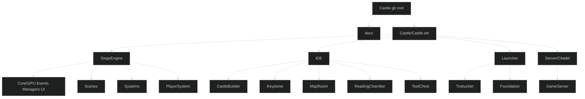

`MapRoom`, `ReadingChamber`, and `ToolChest` are real assemblies, not stubs. `QuestHall` / `ThroneRoom` / `GuildTower` / `ScriptChamber` names in older diagrams are product ideas, not current projects.

## Core class diagram

`SandboxScene` below is historical. Current gameplay types are `RuntimeGameplayScene`, `EditorScene`, and project `[CustomSceneEntry]` scenes. Interfaces are still accurate.


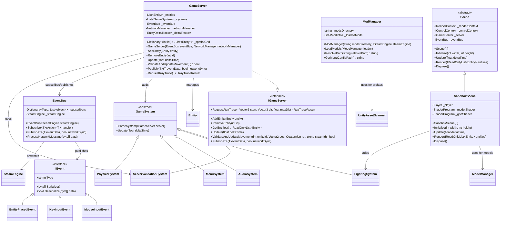
## Startup sequence

Current bootstrap still starts Steam → EventBus → mods → window → UI, but the first authored surface is the **IDE docking tree** (or Foundation Play), not only `SandboxScene`. See [ARCHITECTURE](docs/ARCHITECTURE.md#frame-loop).

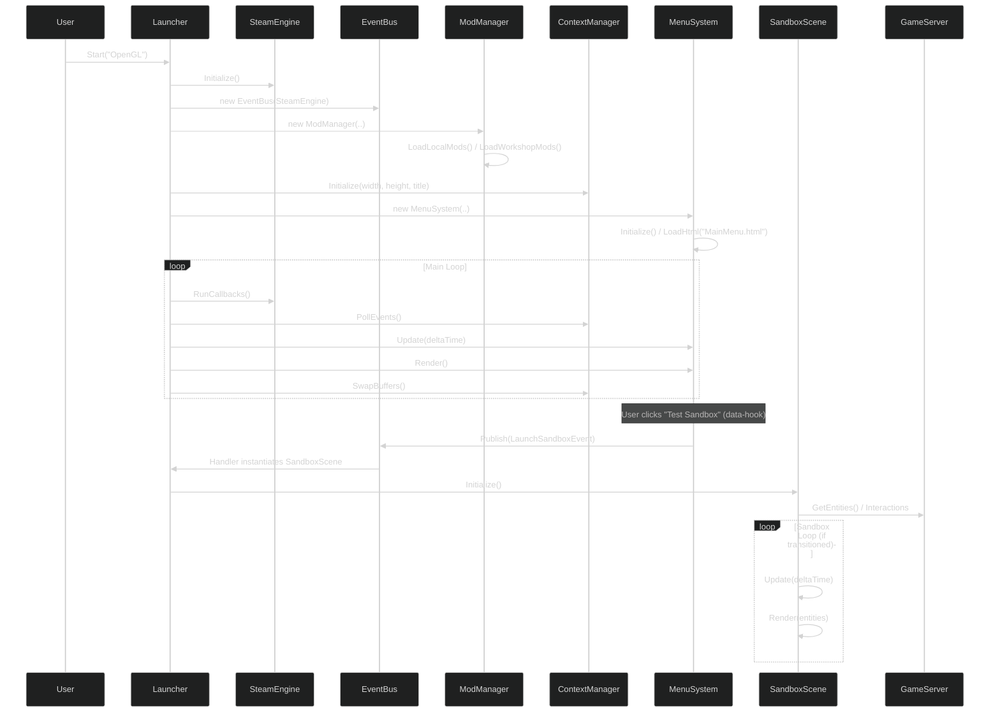
## Component diagram for modularity

Still a valid EventBus / GameServer / Launcher picture. IDE chrome is `PanelManager` + `IDEDockingStrategy`, not MenuSystem alone. Specialized modules are real projects under `Castle/IDE/`.

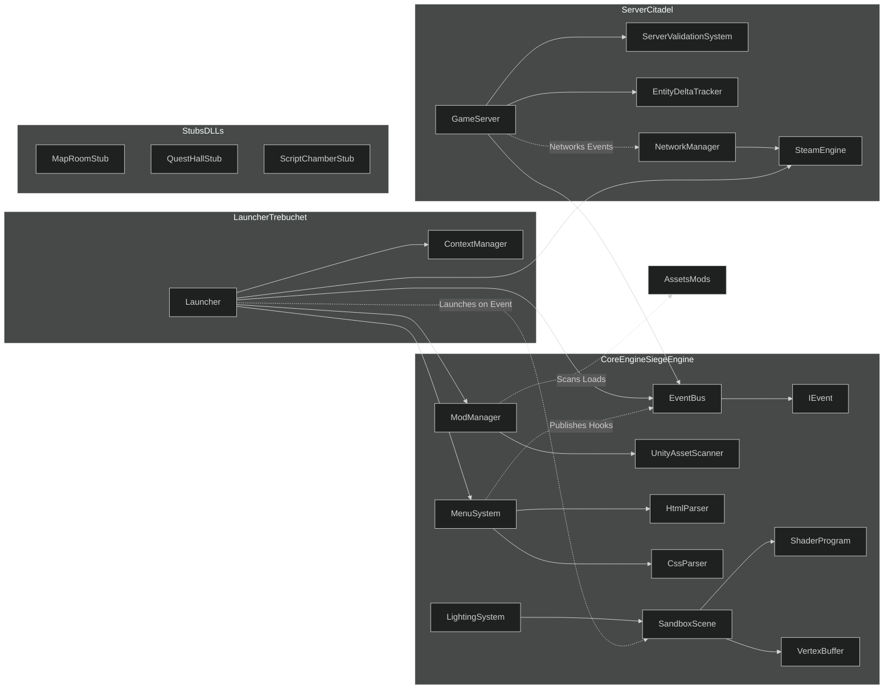
## Rendering system class diagram

Add `SetConstants<T>(ConstantSlot, T)` and `TryGetConstants<T>` to the mental model of `IRenderContext`. Named `SetMatrix4` still exists as a CB fallback. Full contract: [RENDERING](docs/RENDERING.md).


## UI/Menu System Flow Diagram
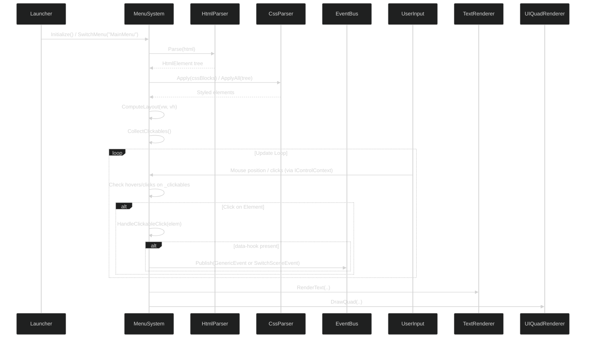
## Event System Class Diagram
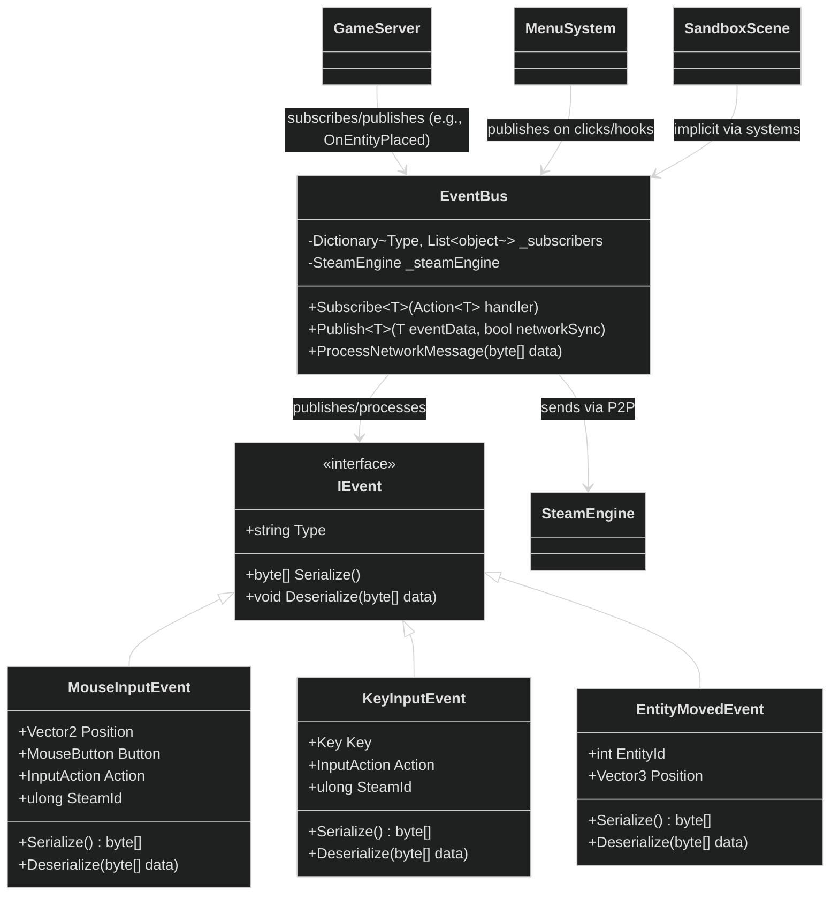
## Server Validation System Flow Diagram
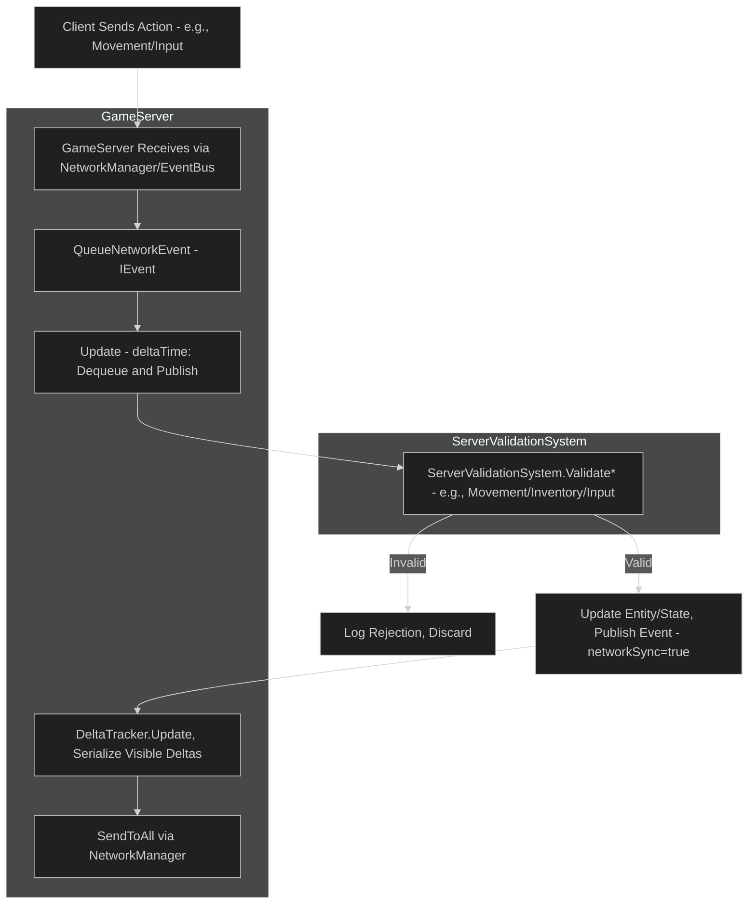
## Audio system

Implemented: `AudioSystem` with a dedicated worker, bank load, AutoPlay entities, and GPU occlusion infrastructure. Ray-trace filtering is still the model; treat quality as evolving, not missing.

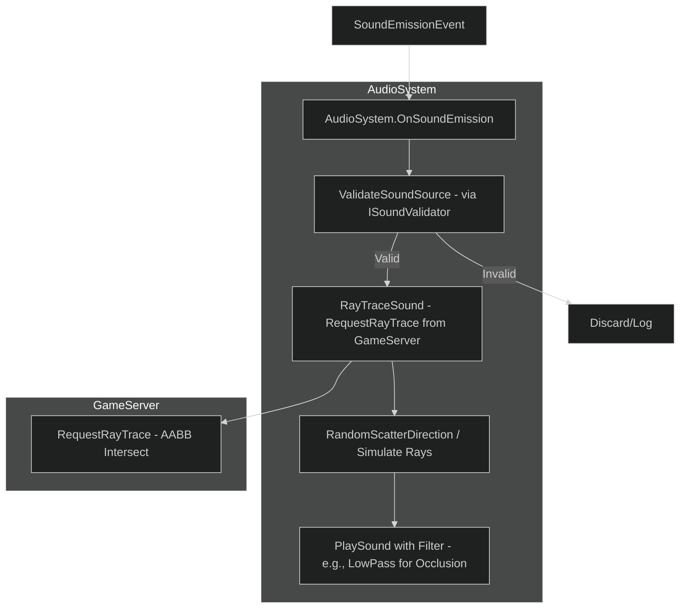
## Entity Management subsystem
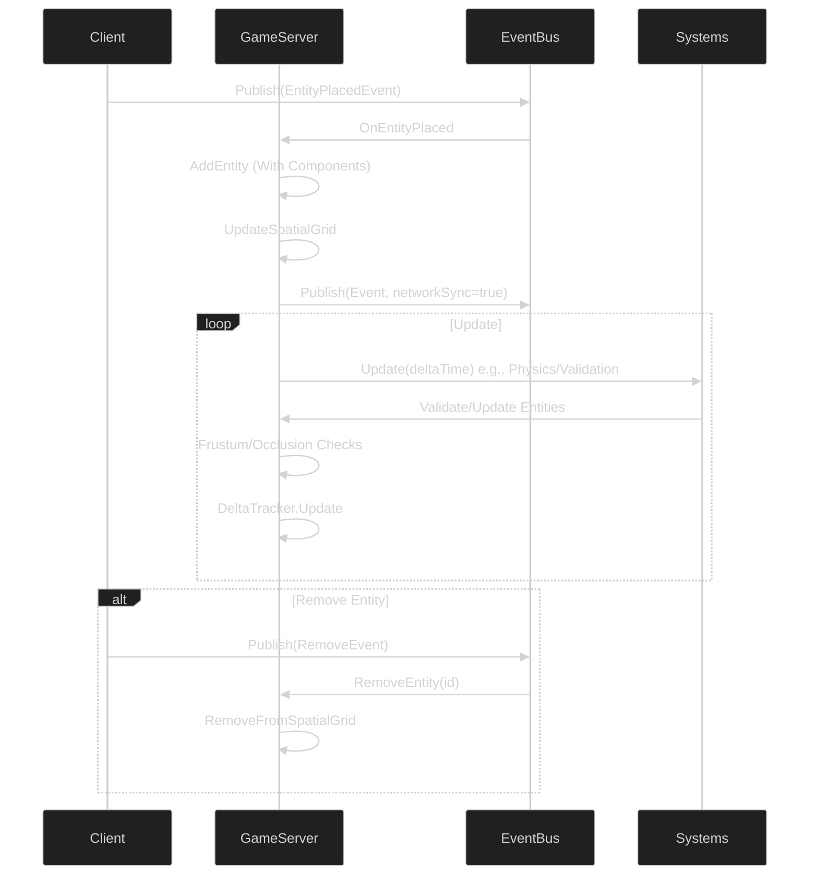
## Lighting subsystem

World path: `LightingFrame.ApplyConstants` → `LightCB` / `ShadowCB`. Terrain still calls `ApplyTo` named uniforms (floor). Fog modes: Off, Exponential, Height (forward), Volumetric (`FogPass`, fragment must define `CascadeVPAt`).

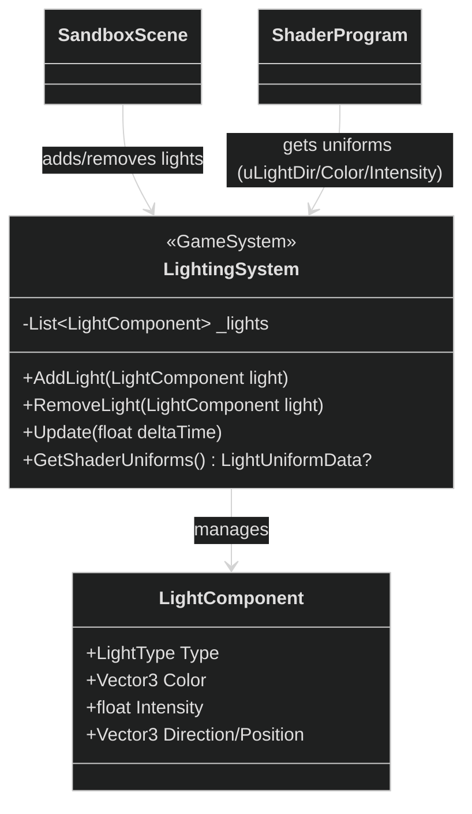
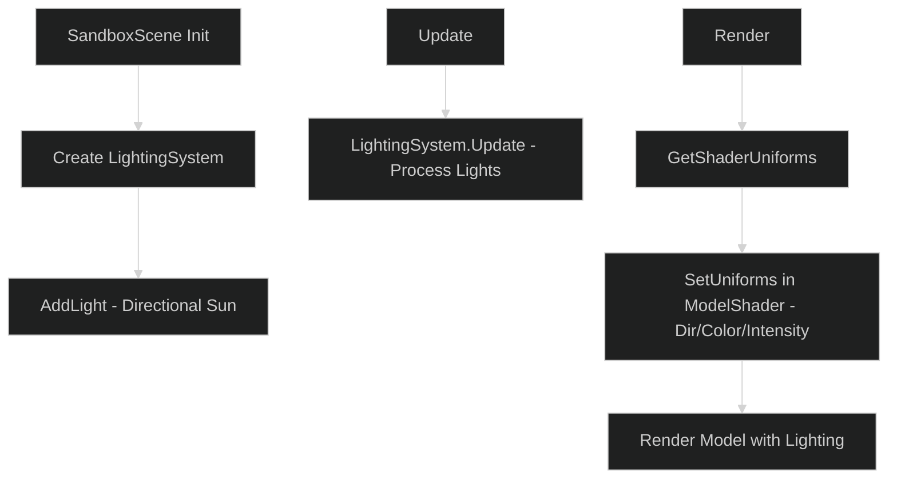
## Event Subsystem (Class + Flow)
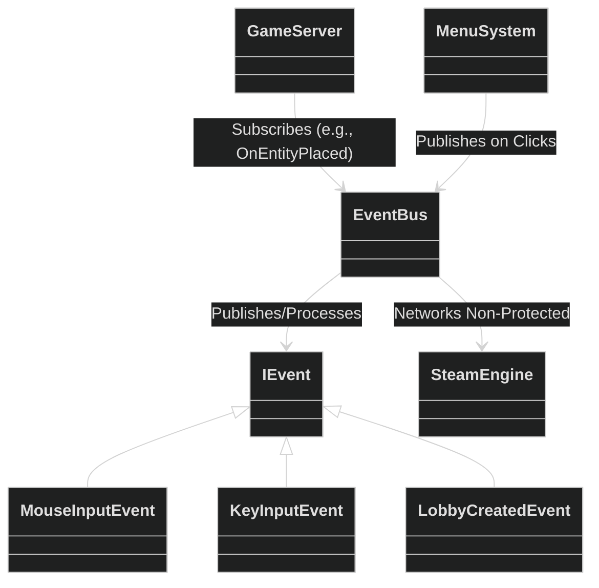
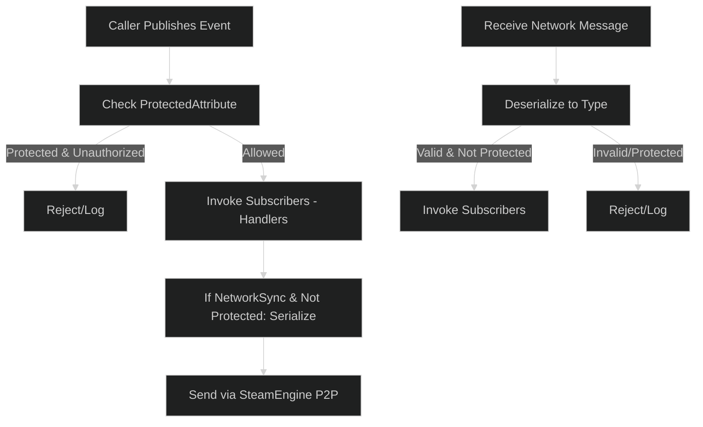
## Rendering subsystem

Replace "Set View/Projection Matrices" in the flowchart with `SetConstants(FrameCB / ObjectCB)`. `SandboxScene.Render` in the diagram is any `Scene.Render`. OpenGL only.

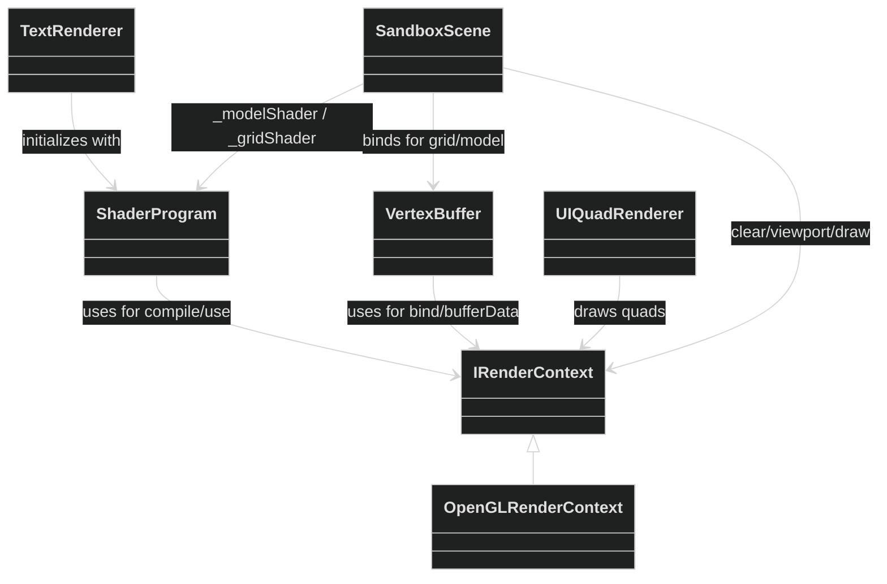
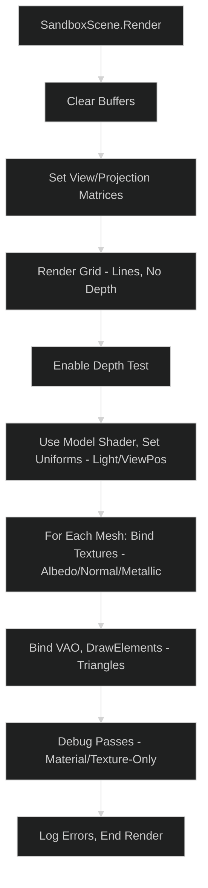