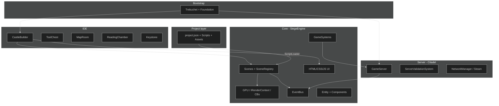
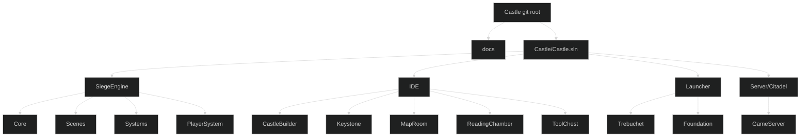
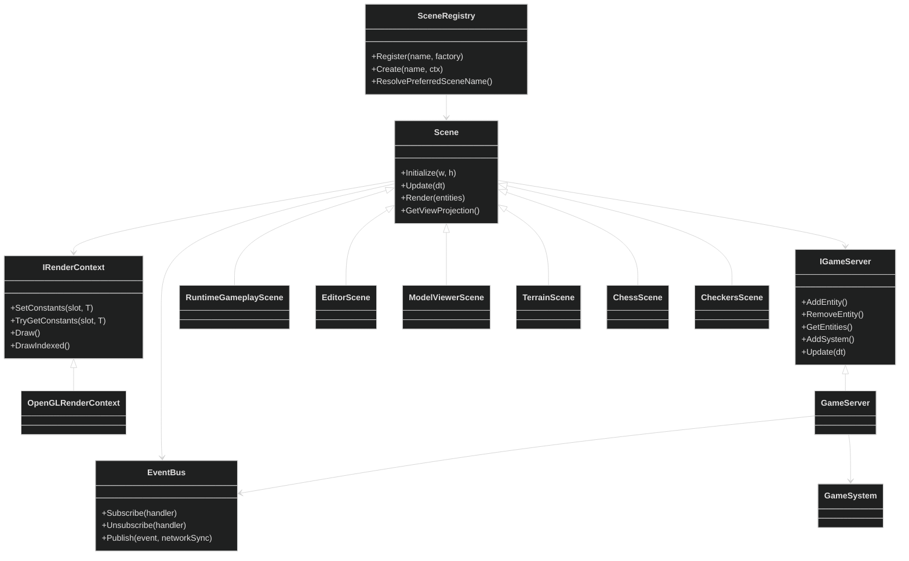
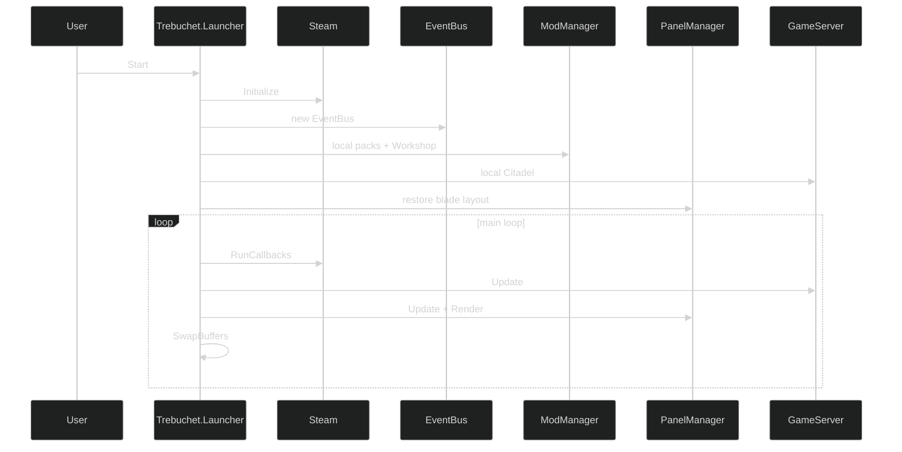
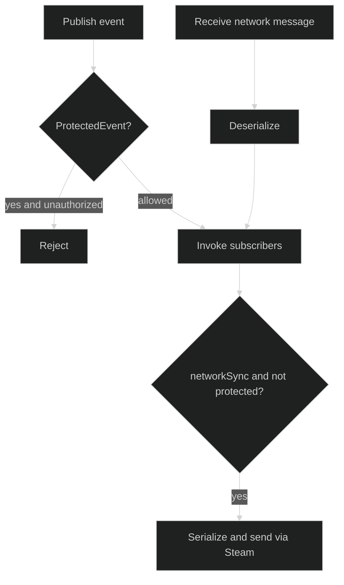
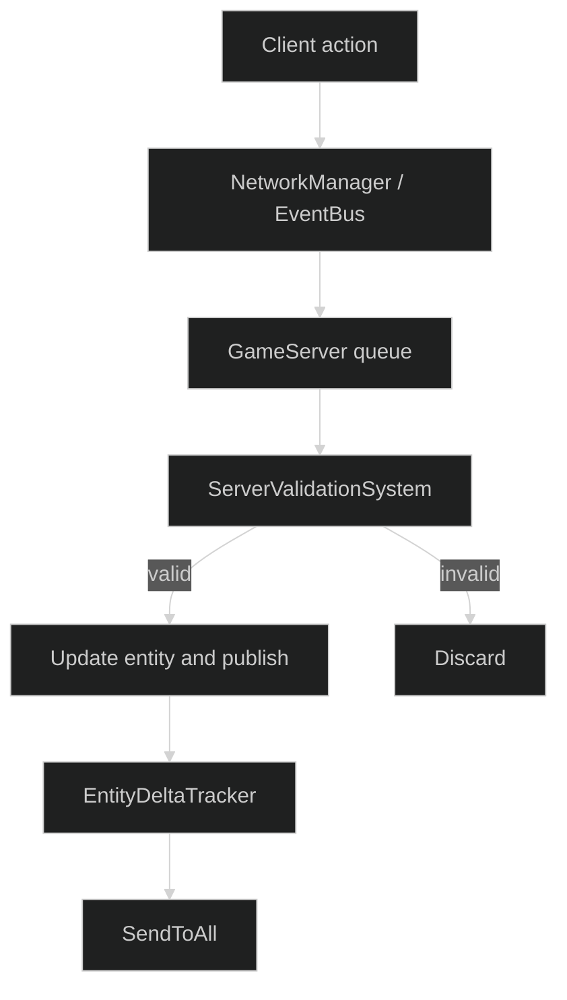
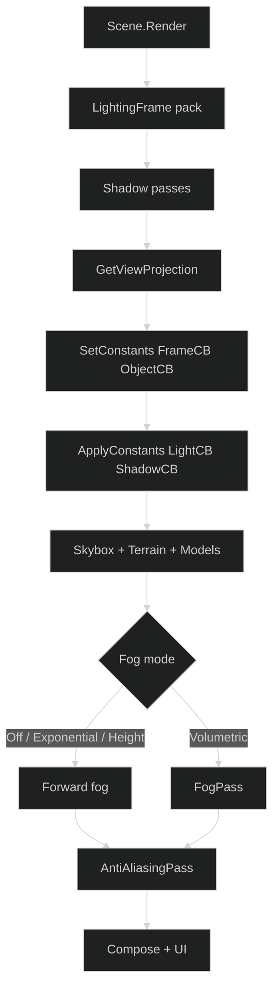
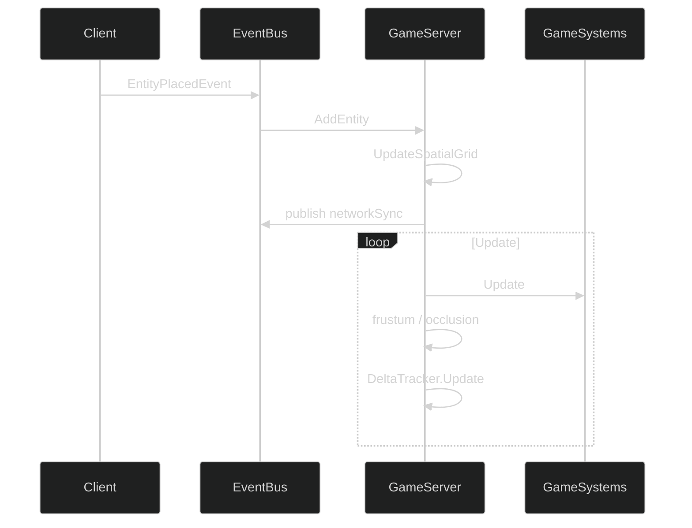

<p align="center">
  
</p>

# RealmFoundry (repository: Castle)

SiegeEngine is a C# engine for real-time multiplayer games. Castle is the IDE built on that engine. Rendering, the asset pipeline, entities and components, EventBus, GameSystems, scenes, and the HTML/CSS/JS UI are one runtime used both to play a game and to build one. The editor is not a second product sitting beside the engine.

## Documentation

| Doc | What it covers |
|---|---|
| [Architecture](docs/ARCHITECTURE.md) | Layers, self-hosting, frame loop, examples repo |
| [Rendering](docs/RENDERING.md) | IRenderContext, constant buffers, OpenGL |
| [Scenes and projects](docs/SCENES_AND_PROJECTS.md) | SceneRegistry, ScriptLoader, hosted preview, Play, Export |
| [IDE](docs/IDE.md) | Blades, docking, CastleBuilder / Keystone / ToolChest |
| [Boundaries](docs/BOUNDARIES.md) | Core vs IDE vs Server vs project scripts |



## Project overview

RealmFoundry is a C# game engine and IDE for custom 3D and board-style games, with multiplayer as part of the runtime rather than an add-on. Creators work as one person or as a community. The tool is modular and authoritative-server based.

### Goals

* **One runtime.** The systems that run a game are the systems that author it: docked tools, live previews, Play, HTML UI, mods.
* **Multiplayer in the same codebase.** Dedicated server, Steam P2P, and local authoritative mode share Citadel validation, spatial grids, and entity deltas.
* **Mods without a second toolchain.** JSON, Steam Workshop, and project script DLLs extend UI, scenes, and systems through EventBus hooks.
* **Projects as data.** A project folder is `project.json`, `Scripts/`, `Assets/`, and per-blade layout JSON. Core receives `Level` and `SceneData`, not the folder schema.

## Security

The server is authoritative (`GameServer`).

* **Validation.** Client movement, inventory, and combat go through `ServerValidationSystem` (speed and distance caps, frustum and occlusion checks).
* **Protected events.** EventBus rejects `ProtectedEvent` publishes from mods and clients.
* **Networked events.** Only non-protected events serialize across Steam. Input events validate before publish.
* **Mods.** `ModManager` loads local packs and Workshop items. Hooks are namespace-qualified.

## Modularity

* **Assemblies.** SiegeEngine (Core), CastleBuilder / Keystone / MapRoom / ReadingChamber / ToolChest (IDE), Citadel (Server), Trebuchet / Foundation / GameHost (bootstrap).
* **Interfaces.** `IGameServer`, `IRenderContext`, `IControlContext`, `IScene`, `IHostedContent`.
* **EventBus.** Strongly typed events for UI, gameplay, networking, and editor actions.
* **UI.** HTML/CSS/JS with `data-hook` methods. The same stack draws the main menu, IDE chrome, and game HUD.
* **Panels.** `PanelManager` and `IDEDockingStrategy` dock, float, and restore layouts per blade (`layout.Scene Editor.json`).
* **Scripts.** `ScriptLoader` compiles project `Scripts/` against `SiegeEngine.dll` and registers `CustomSceneEntry`, `RegisterGameSystem`, `CustomPlayerController`, and `RegisterHostedContent`.

## Technical structure

### Core (SiegeEngine)

* **Events.** `EventBus` pub/sub with optional Steam networking.
* **Rendering.** `IRenderContext` implemented by `OpenGLRenderContext`. World cameras and lighting upload constant buffers (`FrameCB`, `ObjectCB`, `LightCB`, `ShadowCB`, `PostCB`) via `SetConstants`. Terrain GLSL uses named uniforms. Samplers stay named.
* **Assets.** FBX pipeline for meshes, skeletons, animations, materials, textures. `ModelManager` and `TextureLoader`.
* **Entities.** `Entity` plus components, parenting, delta tracking. `Level` is the in-memory source of truth.
* **Systems.** `GameSystem` — physics, audio (worker thread and GPU occlusion), animation, lighting pack, client prediction, project systems.
* **Managers.** `ModManager`, `ScriptLoader`, `SceneManager`, `PanelManager`, `ModelManager`, `UISettingsManager`, `WorkshopManager`.

### Server (Citadel)

* `GameServer` — entities, systems, spatial grid, occlusion, ray traces.
* `ServerValidationSystem` — movement, inventory, combat.
* `EntityDeltaTracker` and `NetworkManager` — Steam P2P or dedicated.

### Bootstrap

* `Trebuchet.Launcher` — Steam, window, local Citadel, IDE loop.
* `Foundation` — isolated Play / Export process. Same `SceneContext` activation as in-process Play.
* `GameHost` — additional host entry.

### Scenes

* `Scene` → `RuntimeGameplayScene`, `GameScene`, `ModelViewerScene`, `TerrainScene`, `EditorScene`.
* Project assemblies add `CustomSceneEntry` types (`ChessScene`, `CheckersScene`) discovered by `ScriptLoader`.

### IDE

* `CastleBuilder` — `EditorScene`, project load/save, Scene Editor, Script Editor, Play Host.
* `Keystone` — `ProjectSettings`, layouts, outliner, undo.
* `MapRoom` — terrain and 2D creators.
* `ReadingChamber` — file picker, animation viewer.
* `ToolChest` — browser, properties, tree, brushes, timeline, blend, console, lights, skybox, post-process.

## Folder structure

```text
Castle/                          git root
  README.md
  docs/
  Prompt.txt
  BlenderScenes/
  Libraries/
  Castle/
    Castle.sln
    Assets/
    SiegeEngine/
      Core/                      GPU, Events, Managers, UI, AssetParsing
      Scenes/                    Scene, SceneRegistry, RuntimeGameplay, ModelViewer, Terrain
      Systems/                   GameSystem, Audio, Animation, Lighting, Prediction
      PlayerSystem/              Player, PlayerMovement, FlyCamera, AngledOrthoCamera
    IDE/
      CastleBuilder/
      Keystone/
      MapRoom/
      ReadingChamber/
      ToolChest/
    Launcher/
      Trebuchet/
      Foundation/
      GameHost/
    Server/Citadel/
```

Example games live in `ireakhavok/Siege_Engine_Example_Projects`.



## Runtime objects



## Startup



Load Project runs `BlueprintManager` → `EditorScene.LoadProjectData` → `ScriptLoader.ActivateProjectScripts` → `SceneRegistry` hosted preview.

Play builds a `SceneContext` in-process (Play Host) or in Foundation (isolated). Both call the same activation path. Export is that path plus copied assets.

## EventBus



## Server validation



## Rendering



World and camera data move through constant buffers. Terrain GLSL uses named uniforms. Samplers are named uniforms. Details: [docs/RENDERING.md](docs/RENDERING.md).

## Entity updates



## Lighting and audio

World lighting is `LightingFrame` uploaded as `LightCB` and `ShadowCB`. Fog modes are Off, Exponential, Height (forward in `SceneShader`), and Volumetric (`FogPass`). Volumetric fragment and vertex shaders each define `CascadeVPAt`.

Audio is `AudioSystem`: dedicated worker, bank load, AutoPlay entities, GPU occlusion, and server ray traces for blockage.

## Dependencies

Silk.NET OpenGL. Steamworks. Windows is the supported desktop target.
