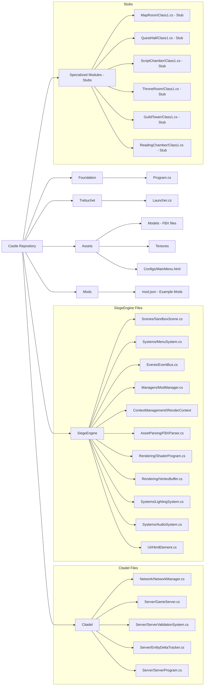
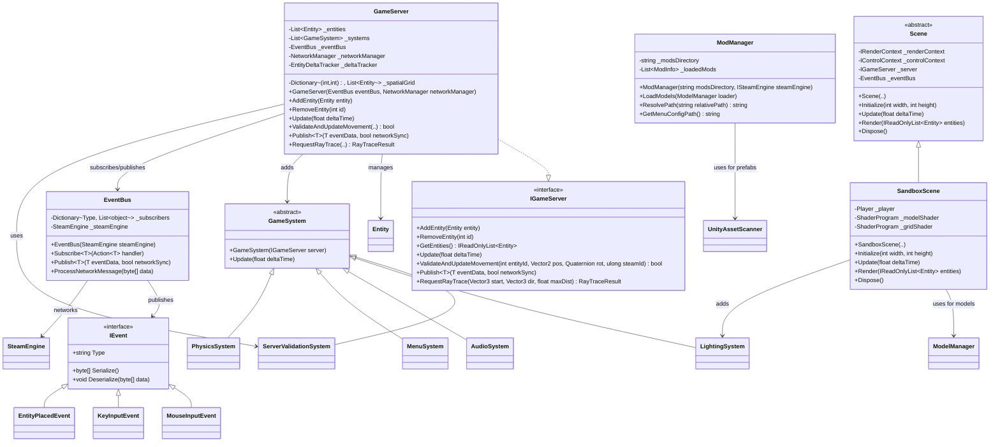
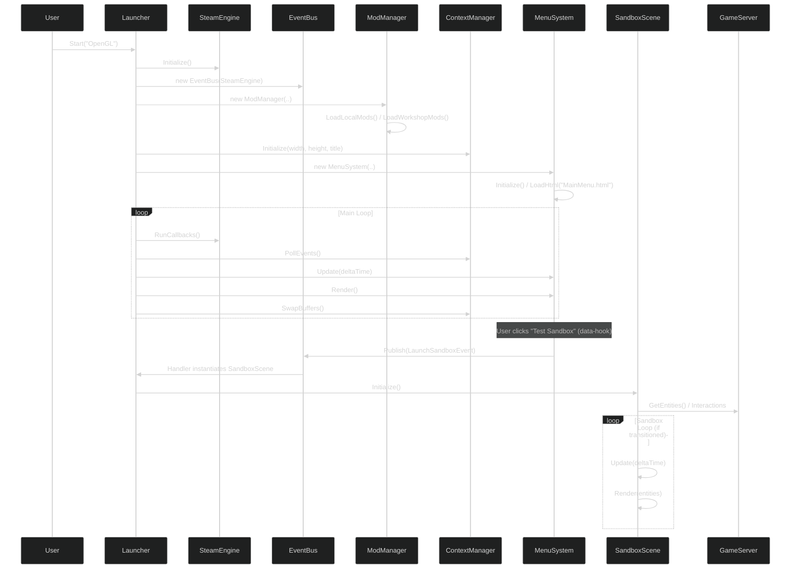
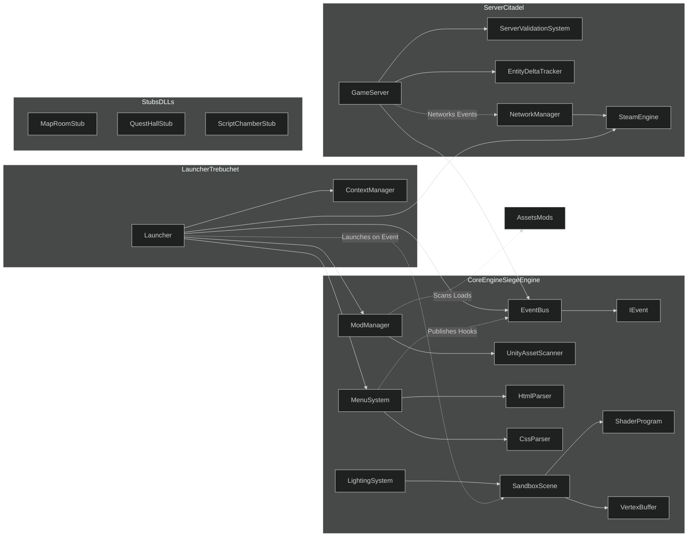
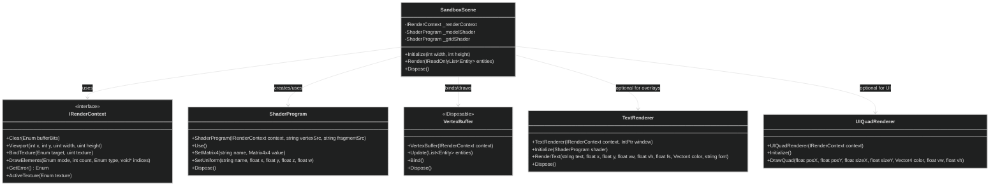
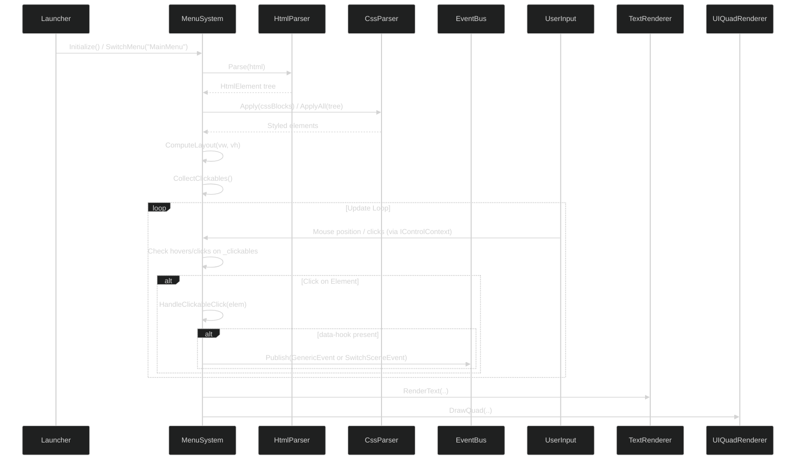
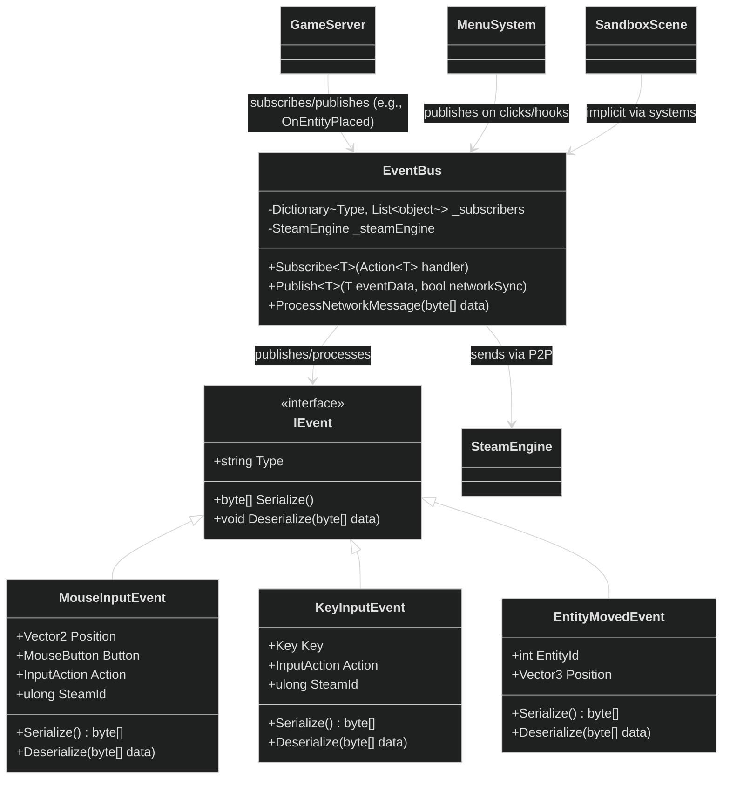

# RealmFoundry Project (Repository: Castle) - README.md

## Project Overview

RealmFoundry is an ambitious, open-source C#-based game engine and Integrated Development Environment (IDE) hybrid, designed to democratize the creation and playing of custom 3D video games, with a strong emphasis on real-time multiplayer experiences supporting hundreds of players. Drawing inspiration from tools like Unity, Godot, RPG Maker, and multiplayer engines, it transforms game development into a rewarding "meta-game" where creators—solo hobbyists, small teams, or larger communities—can build, mod, share, and collaborate on content without facing steep learning curves, mod conflicts, or inadequate multiplayer support. The engine prioritizes intuitive workflows, seamless previews, and instant testing, making the act of creation as engaging as gameplay itself. At its core, RealmFoundry functions as a professional-grade game creator tool: modular, extensible, and secure, rather than a prototype lacking robust editor features.

### Main Goals

The primary objectives of RealmFoundry are multifaceted, focusing on accessibility, collaboration, and scalability:

* **Empower Creators**: Enable non-professional developers to craft immersive MMORPG-style games with custom events (e.g., dialogues, shops, quests) using drag-and-drop interfaces, visual scripting, and asset importers. The IDE leverages the engine's own systems (e.g., rendering pipeline, event bus) for self-modifiability, allowing users to customize the tool itself via mods.
* **Seamless Multiplayer Integration**: Support dedicated servers, P2P, and solo modes out-of-the-box, with built-in anti-cheat mechanisms to ensure fair play. This includes real-time synchronization for hundreds of players, optimized bandwidth via entity deltas, and future expansions to multi-user IDE sessions where collaborators can edit shared projects as if in a multiplayer game.
* **Modding and Sharing Ecosystem**: Facilitate easy mod creation and distribution through JSON configs, Steam Workshop integration, and modular DLLs. Mods can extend UI, add blueprints (e.g., 2D/3D starters like FPS or isometric views), or introduce new mechanics without conflicts, fostering community-driven content.
* **Cross-Purpose Foundation**: Build a unified codebase where the engine powers both runtime gameplay and IDE tools, ensuring consistency and reusability. This allows for popping out panels into independent windows, dynamic loading of modules, and using game systems (e.g., physics, lighting) within editor previews.
* **Performance and Scalability**: Optimize for large-scale worlds with spatial grids, frustum culling, and occlusion checks, while maintaining cross-platform potential (Windows primary, with abstractions for Mac/Linux via OpenGL/Vulkan).
* **Community and Governance**: Incorporate features like server rulesets (ThroneRoom), social lobbies (GuildTower), and governance tools to manage collaborative projects, promoting inclusive development.

By achieving these goals, RealmFoundry aims to bridge the gap between simple game makers and full engines, creating a "Citadel" of creativity where users build virtual realms collaboratively and securely.

## Key Concepts

### Security

Security is a foundational pillar in RealmFoundry, especially given its multiplayer focus and moddable nature. The engine employs an authoritative server model (via GameServer.cs) to prevent cheating:

* **Validation Mechanisms**: All client actions (e.g., movement, inventory changes, combat) are validated server-side using ServerValidationSystem.cs. This includes speed/distance checks (e.g., maxSpeed=20f, maxDistance=20f), frustum-based visibility to limit data exposure, and occlusion checks to simulate realistic line-of-sight, reducing exploits like wall-hacks.
* **Protected Events**: EventBus.cs uses \[ProtectedEventAttribute] to restrict publishing of sensitive events to internal callers (e.g., Citadel namespace), preventing modders or clients from injecting unauthorized actions.
* **Networked Event Sync**: Only non-protected events are networked via SteamEngine, with serialization/deserialization ensuring data integrity. Input events (MouseInputEvent, KeyInputEvent) are validated before publishing.
* **Mod Security**: ModManager.cs whitelists hooks and scans mods for safe loading; future plans include sandboxing DLLs to prevent malicious code. Workshop items are fetched via Steam SDK, leveraging Valve's moderation.
* **Anti-Cheat Optimizations**: Spatial grids and delta tracking minimize unnecessary data transmission, while raytracing for sounds/physics adds layers of server-side simulation to detect anomalies.

This approach ensures a secure environment for multiplayer games and collaborative editing, minimizing risks in shared IDE sessions.

### Modularity

RealmFoundry's architecture is highly modular to support extensibility and avoid monolithic code:

* **DLL-Based Modules**: Specialized features (e.g., MapRoom.dll for level editing, ScriptChamber.dll for VS Code integration, QuestHall.dll for node-based quests) are loadable DLLs. ModManager.cs can be extended with Assembly.LoadFrom for dynamic resolution, allowing mods to add or override panels.
* **Abstractions and Interfaces**: Core components use interfaces like IGameServer (for server logic), IRenderContext (for rendering pipelines, currently OpenGL), IControlContext (for inputs), and planned IPanel (for dockable IDE windows with Init/Update/Render/Dispose and DockState enum). This enables swapping backends (e.g., Vulkan) or extending without recompilation.
* **Event-Driven Design**: EventBus.cs decouples systems via strongly-typed IEvents, supporting networked sync and mod injections (e.g., custom events from mods).
* **UI Extensibility**: MenuSystem.cs parses HTML/CSS for menus/panels, with data-hooks invoking namespace-qualified methods (e.g., "SiegeEngine.AssetParsing.FBXParser.Load"). Mods can override HTML files (e.g., DevMenu.html) for custom layouts.
* **Asset and Project Modularity**: ModManager scans for assets (FBX, textures, Unity prefabs) and projects (as JSON blueprints). Projects load as self-contained modules, rendering in panels using shared engine systems.
* **Panel Management**: Future PanelManager.cs will handle docking, resizing, and layout saving, with panels popping out into new windows via additional ContextManager instances for independent rendering loops.

This modularity ensures the engine/IDE can evolve through community contributions, with clean separation to prevent circular dependencies.

### Multi-User and Collaboration

While currently client-side focused, the engine is designed for P2P expansion: GameServer can sync IDE states (e.g., entity placements in MapRoom) via events, turning the IDE into a multiplayer "game" for real-time co-editing. ThroneRoom.dll will govern rules/configs for collaborative sessions.

## Technical Structure

### Core Engine (SiegeEngine)

* **Events**: EventBus.cs manages pub/sub with networking; examples include MouseInputEvent, KeyInputEvent.
* **Rendering**: OpenGL abstractions; ShaderProgram for custom shaders (e.g., model with PBR); VertexBuffer for entity data; TextRenderer/UIQuadRenderer for UI.
* **Asset Parsing**: FBXParser.cs and helpers for models/animations; UnityAssetLoader for prefabs/GUIDs.
* **Systems**: GameSystem base; includes Lighting (uniforms), Audio (raytracing), Physics, MenuSystem (HTML UI), ClientPrediction.
* **Managers**: ModManager (mods/assets), UISettingsManager (resolutions/fullscreen).

### Server (Citadel)

* **GameServer.cs**: Entity/system management, spatial optimization, validation, raytracing.
* **NetworkManager.cs**: P2P messaging via Steam.

### Launcher (Trebuchet)

* **Launcher.cs**: Initializes Steam/server, contexts, mods, menu; main loop.

### Scenes

* **SandboxScene.cs**: 3D demo with player, grid, lighting; renders models with multi-textures.

### UI Elements

* HTML-parsed with CSS support; elements like ButtonElement, SelectElement handle interactions.

## Development Status and Roadmap

* Stable vertical slice: 3D sandbox, HTML menu, server validation.
* Next: Dev menu template, DLL stubs (IPanel), dynamic loading, project modules, P2P IDE sync.
* Dependencies: Silk.NET, Steam SDK; no internet/pip.
## Folder Structure

## Core Class Diagram


## Startup Sequence

## Component Diagram for Modularity

## Rendering System Class Diagram

## UI/Menu System Flow Diagram

## Event System Class Diagram

## Server Validation System Flow Diagram
```mermaid
%%{init: {'theme':'dark'}}%%
flowchart TD
    A[Client Sends Action (e.g., Movement/Input)] --> B[GameServer Receives via NetworkManager/EventBus]
    B --> C[QueueNetworkEvent(IEvent)]
    C --> D[Update(deltaTime): Dequeue and Publish]
    D --> E[ServerValidationSystem.Validate* (e.g., Movement/Inventory/Input)]
    E -->|Valid| F[Update Entity/State, Publish Event (networkSync=true)]
    E -->|Invalid| G[Log Rejection, Discard]
    F --> H[DeltaTracker.Update, Serialize Visible Deltas]
    H --> I[SendToAll via NetworkManager]
    subgraph GameServer
    B
    C
    D
    H
    I
    end
    subgraph ServerValidationSystem
    E
    end
```
```mermaid

```
```mermaid

```
```mermaid

```
