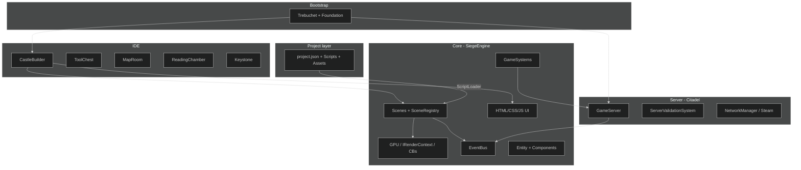
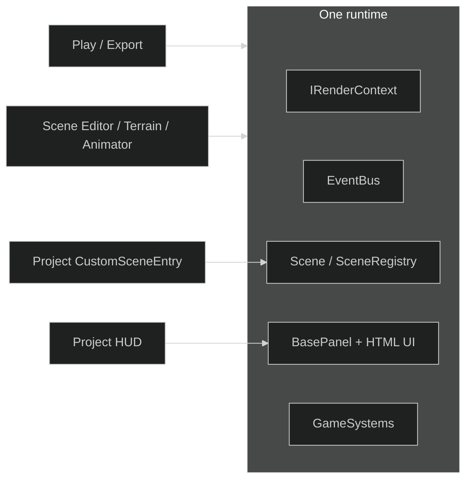
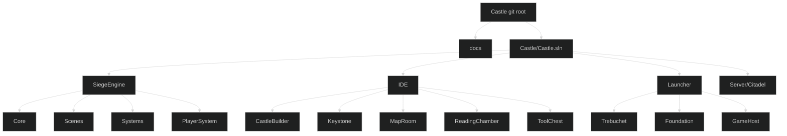
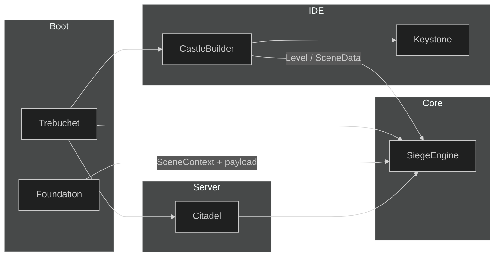
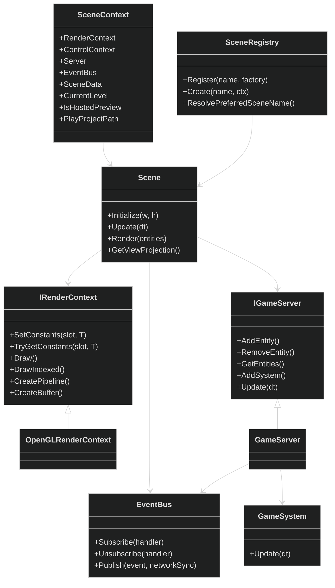
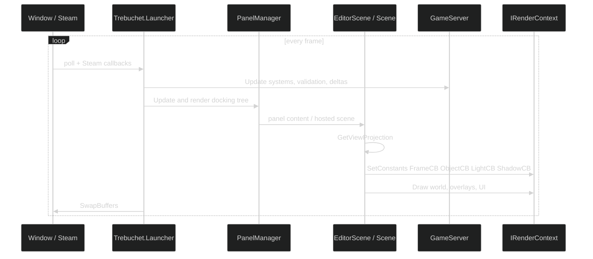
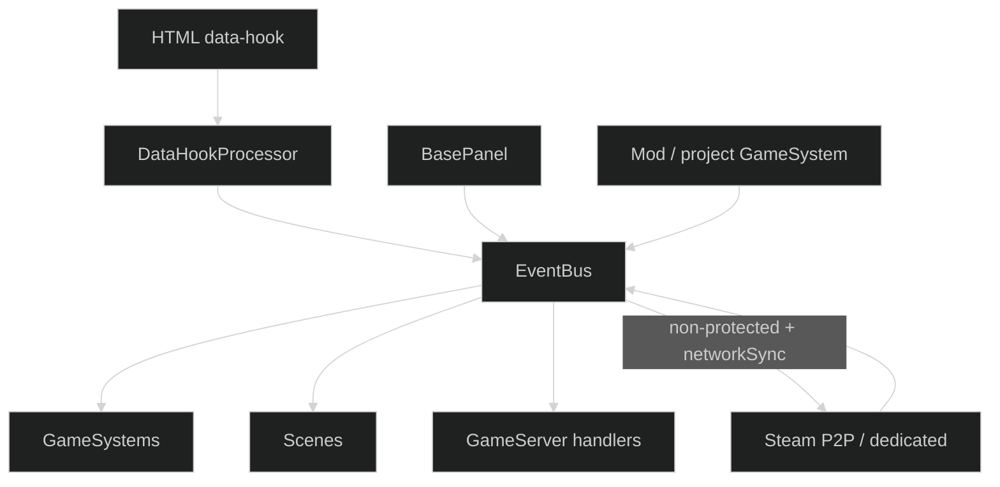
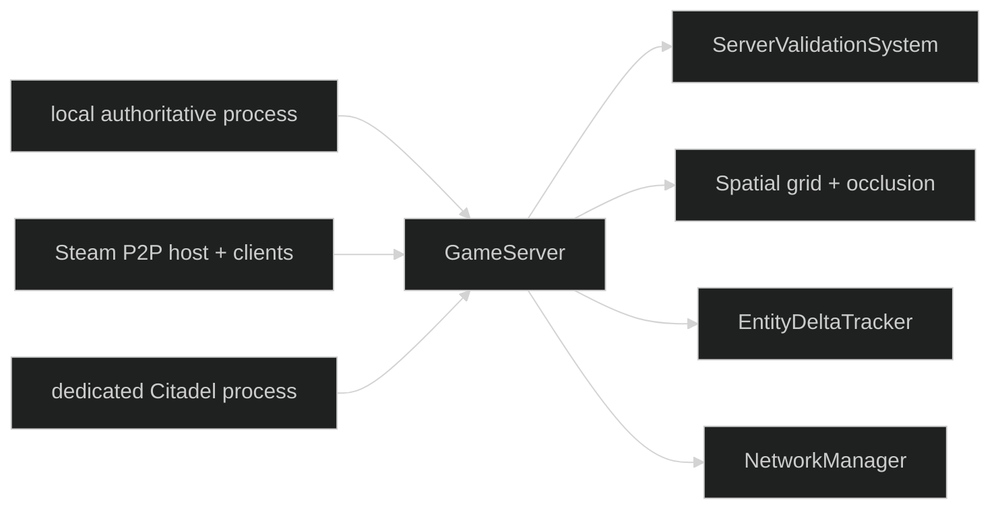

# Castle architecture

SiegeEngine is the runtime. Castle is the IDE built on that runtime. Rendering, the asset pipeline, entities, EventBus, GameSystems, scenes, and the HTML/CSS/JS UI are one program used both to play a game and to author one.



Related pages:

- [Rendering](RENDERING.md)
- [Scenes and projects](SCENES_AND_PROJECTS.md)
- [IDE](IDE.md)
- [Boundaries](BOUNDARIES.md)

---

## Self-hosting

CastleBuilder is SiegeEngine in editor mode.

- Docked tools are `BasePanel` instances drawn by the same UI path as a game HUD.
- The Scene Editor viewport is an `EditorScene` that hosts a gameplay `Scene` as a view-only child when the project registers one.
- Play builds a `SceneContext` and asks `SceneRegistry` for a scene.
- Isolated Play launches Foundation with a payload.
- Export is that Play path plus copied assets.
- A project type marked `CustomSceneEntry` is discovered by `ScriptLoader` and registered as a scene.



---

## Repository layout

GitHub repo: `ireakhavok/Castle`. The Visual Studio solution is one folder down.

```text
Castle/                          git root
  README.md
  docs/
  Prompt.txt
  Prompt_v2.txt
  main_banner.png
  BlenderScenes/
  Libraries/
  Castle/                        solution root
    Castle.sln
    Assets/
    SiegeEngine/
    IDE/
    Launcher/
    Server/Citadel/
```

Example games are a separate repo: `ireakhavok/Siege_Engine_Example_Projects` (`chess`, `checkers`, `checkers_v2`, `save3`). They consume `SiegeEngine.dll` through `ScriptLoader`. They do not reference CastleBuilder.



---

## Four concerns

These share a runtime and stay out of each other's types.

| Concern | Assemblies | Owns | Does not own |
|---|---|---|---|
| Core | SiegeEngine | Rendering, assets, entities, EventBus, GameSystems, scenes, HTML UI, mod load, Steam client helpers | ProjectSettings, Keystone, project folders, CastleBuilder types |
| IDE | CastleBuilder, Keystone, MapRoom, ReadingChamber, ToolChest | Projects on disk, blades, docking layouts, browsers, properties, brushes, animation editors | Authoritative simulation; a second renderer |
| Server | Citadel | Validation, spatial grid, deltas, broadcast | IDE types; rendering |
| Bootstrap | Trebuchet, Foundation, GameHost | Steam init, window, settings, loop, isolated Play process | Game rules; project schema |

Foundation is the isolated Play / Export process. Trebuchet is the IDE-and-local-server process. Both construct a `SceneContext` and hand it to Core. Core does not open `project.json`.



---

## Runtime objects



`Level` is the in-memory source of truth for entities, terrain, skybox, environment, and custom data. The folder on disk is persistence and Export. Play runs from memory.

---

## Frame loop



Play is the same loop without docking chrome. A hosted custom scene inside the Scene Editor uses `Scene.Render` with `IsHostedPreview = true`, so input and AI stay off.

---

## Communication

Cross-layer traffic uses EventBus or a payload on `SceneContext`.



Events marked `ProtectedEvent` cannot be published by mods or clients. Panel and scene handlers that `Subscribe` also `Unsubscribe` on dispose.

---

## Networking

Citadel runs in three deployments:



---

## Cameras

`FlyCameraController` and `AngledOrthoCamera` are Core runtime cameras. They are views, not `PlayerMovement`.

A scene may use a fly camera, a player controller, both, or neither.

Board games override `Scene.GetViewProjection` with an orthographic look-at and write `FrameCB` / `ObjectCB`.

---

## Examples repo

A project is:

```text
project.json
Scripts/                 compiled by ScriptLoader
Scripts/Libs/            SiegeEngine.dll + SiegeScripts.dll
Assets/
layout.<Context>.json    docking layout per blade
```

Discovery:

1. `CustomSceneEntry` on a `Scene` subclass registers `type.Name`.
2. `RegisterGameSystem` constructs the system and adds it to the server.
3. `CustomPlayerController` or `SceneData.Settings.ControllerTypeName` selects movement.
4. `RegisterHostedContent` supplies HUD content; the host supplies chrome.
5. A runtime hook may remap the name `RuntimeGameplay` so Play constructs the project scene.

`SceneData.customSceneClass` names the hosted scene. If that field is empty and the project registered exactly one custom scene, the registry uses that scene.
