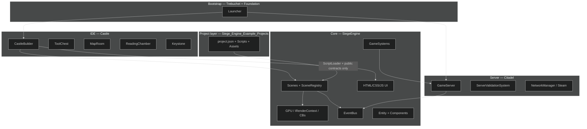
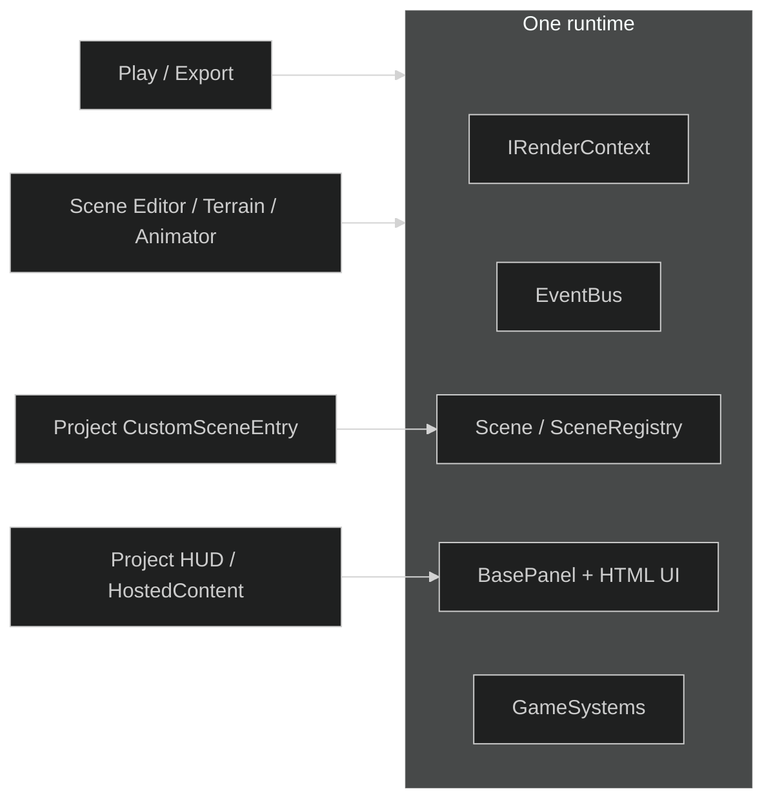
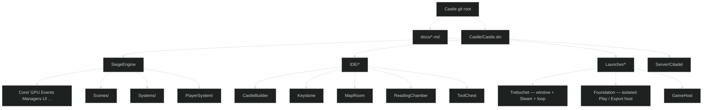
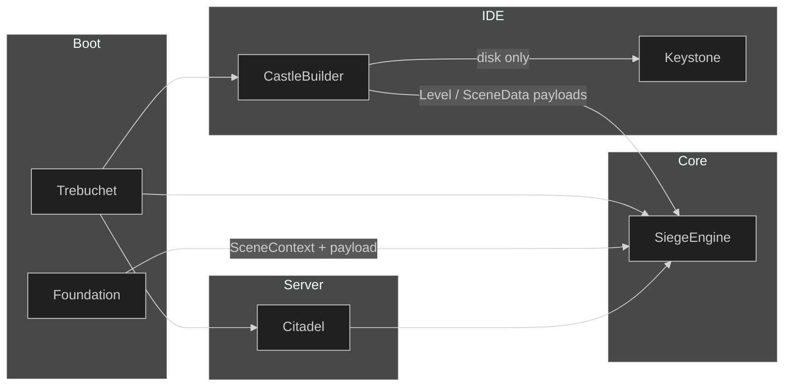
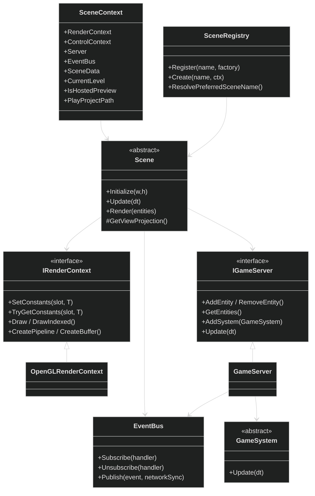
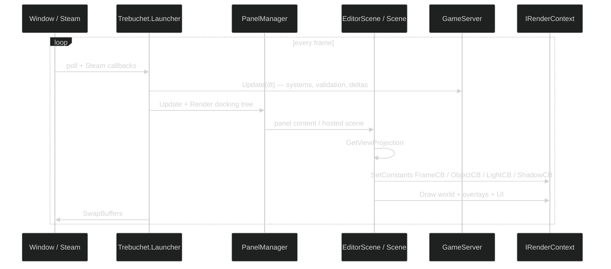
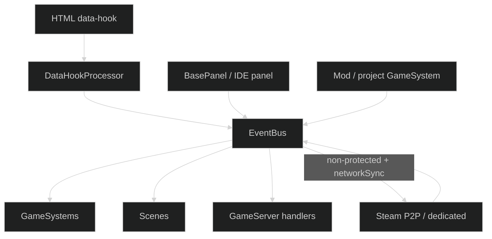
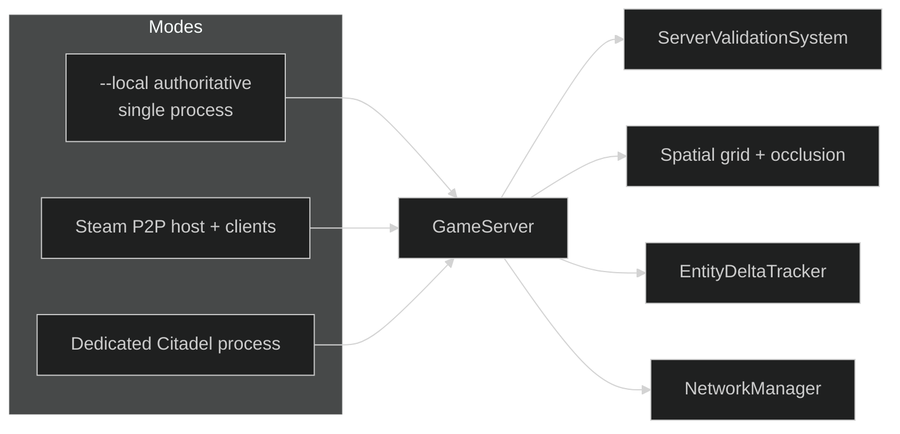

# Castle architecture

This is the living map of the **Castle** repository. The product name in older docs is **RealmFoundry**. The engine is **SiegeEngine**. The self-hosting IDE is **Castle** / **CastleBuilder**. They are one runtime, not two products glued together.



Related pages:

- [Rendering and constant buffers](RENDERING.md)
- [Scenes, Play, and project scripts](SCENES_AND_PROJECTS.md)
- [IDE blades and docking](IDE.md)
- [Layer boundaries](BOUNDARIES.md)

---

## What "self-hosting" means

Rendering, the FBX pipeline, entities and components, EventBus, GameSystems, scenes, and the HTML/CSS/JS UI are the same runtime used to **play** a game and to **author** one. CastleBuilder is not a second engine sitting beside SiegeEngine. It is SiegeEngine running in editor mode:

- Docked tools are `BasePanel` instances rendered by the same UI path as a game HUD.
- The Scene Editor viewport is an `EditorScene` that can **host** a gameplay `Scene` as a view-only child.
- Play builds a `SceneContext` and asks `SceneRegistry` for a scene. Isolated Play launches Foundation with a payload. Export is that Play path plus copied assets.
- A project script marked `[CustomSceneEntry]` is discovered by `ScriptLoader` and becomes a first-class scene. Chess and checkers are examples of that contract, not engine forks.



---

## Repository layout

The GitHub repo is `ireakhavok/Castle`. The Visual Studio solution lives one folder down.

```text
Castle/                          ← git root
  README.md
  docs/                          ← this documentation
  Prompt.txt / Prompt_v2.txt     ← working briefs for the engine/IDE contract
  main_banner.png
  BlenderScenes/                 ← source art, not runtime
  Libraries/                     ← Steam redistributables
  Castle/                        ← solution root
    Castle.sln
    Assets/                      ← engine/IDE shipped assets
    SiegeEngine/                 ← Core runtime
    IDE/                         ← CastleBuilder + satellite assemblies
    Launcher/                    ← Trebuchet, Foundation, GameHost
    Server/Citadel/              ← authoritative server
```

Example games are a **separate** repo: `ireakhavok/Siege_Engine_Example_Projects` (`chess`, `checkers`, `checkers_v2`, `save3`). They consume `SiegeEngine.dll` through `ScriptLoader`. They must not take a project reference on CastleBuilder.



---

## The four concerns

These share a runtime and stay out of each other's types. That sentence is the whole architecture.

| Concern | Assemblies | Owns | Must not own |
|---|---|---|---|
| **Core** | `SiegeEngine` | Rendering, assets, entities, EventBus, GameSystems, scenes, HTML UI, mod load, Steam client helpers | `ProjectSettings`, `Keystone`, disk project folders, CastleBuilder types |
| **IDE** | `CastleBuilder`, `Keystone`, `MapRoom`, `ReadingChamber`, `ToolChest` | Projects on disk, blades, docking layouts, asset browsers, properties, brushes, animation editors | Authoritative gameplay simulation; inventing a second renderer |
| **Server** | `Citadel` | Validation, spatial grid, deltas, broadcast | IDE types; rendering |
| **Bootstrap** | `Trebuchet`, `Foundation`, `GameHost` | Steam init, window, settings, loop, isolated Play process | Game rules; project schema |

`Foundation` is the isolated Play / Export process. `Trebuchet` is the IDE-and-local-server process. Both construct a `SceneContext` and hand it to Core. Core never opens `project.json`.



---

## Runtime objects



`Level` is the in-memory source of truth for entities, terrain, skybox, environment, and custom data. The folder on disk is persistence and Export only. Play is in-memory.

---

## Frame loop



Play (in-process or Foundation) is the same loop without the docking chrome. The hosted custom scene inside the Scene Editor is the same `Scene.Render` Play uses, with `IsHostedPreview = true` so input and AI stay muted.

---

## Communication

Everything that crosses a layer goes through **EventBus** or a **payload on SceneContext**. There is no second hidden channel.



Protected events (`[ProtectedEvent]`) cannot be published by mods or clients. Subscribe in `Initialize` without `Unsubscribe` on dispose is a recurring blade-restore bug — unsubscribe first if you touch a panel.

---

## Networking modes

The same Citadel code runs three ways:



IDE collaboration (multi-user Scene Editor) is designed against this same bus. It is not a second netcode.

---

## Cameras

`FlyCameraController`, `AngledOrthoCamera`, and friends are **Core runtime cameras**, not IDE-only toys. They are optional views: preview an environment, free-look, inspect a space without possessing a body.

- They are not `PlayerMovement`.
- A runtime scene may have a fly camera, a player controller, both, or neither.
- Board games (chess, checkers) override `Scene.GetViewProjection` with an orthographic look-at and write `FrameCB` / `ObjectCB`. That is a scene contract, not a special editor camera.

---

## What is production vs. what is open

Treated as floors — do not reopen to "clean up":

- Point shadows
- Non-gray scene lighting
- Model viewer mesh + Play deformation
- Original viewer background
- Animation blend panel: one node per add
- OpenGL world path through `IRenderContext.SetConstants`
- Chess / checkers board camera via `GetViewProjection` + CBs
- Volumetric fog fragment must define `CascadeVPAt` (vertex functions are not shared)

Open / incremental:

- Terrain editor GLSL is still named uniforms (`uView`, `uProjection`, `uCascadeVP`) — allowed floor
- Leftover `SetMatrix4("uView")` calls on some engine paths; `ShaderProgram` patches them into cached CBs
- DirectX 11/12 appear in settings as *available renderer names*. **No DirectX or Vulkan backend exists.** Do not start one from a drive-by edit
- First-class 2D / isometric camera mode so a project does not have to subclass `Scene` just to get a top-down board

---

## Examples repo

`Siege_Engine_Example_Projects` is not inside this solution. A project is:

```text
project.json          Type, CameraType, scenes, environment
Scripts/              C# compiled by ScriptLoader
Scripts/Libs/         copied SiegeEngine.dll + output SiegeScripts.dll
Assets/               FBX, textures, audio, terrain
layout.<Context>.json saved docking layout per blade
```

Discovery:

1. `[CustomSceneEntry]` on a `Scene` subclass → `SceneRegistry.Register(type.Name)`
2. `[RegisterGameSystem]` → constructed and `IGameServer.AddSystem`
3. `[CustomPlayerController]` or `SceneData.Settings.ControllerTypeName` → movement swap
4. `[RegisterHostedContent]` → HUD / content hosted in editor chrome
5. Optional `RuntimeHook` remaps the core name `"RuntimeGameplay"` so classic Play does not spawn the empty default scene

`SceneData.customSceneClass` is the explicit, first-class way to name the hosted scene. The "exactly one custom factory" fallback exists so a single-scene project works before that field is filled in.
