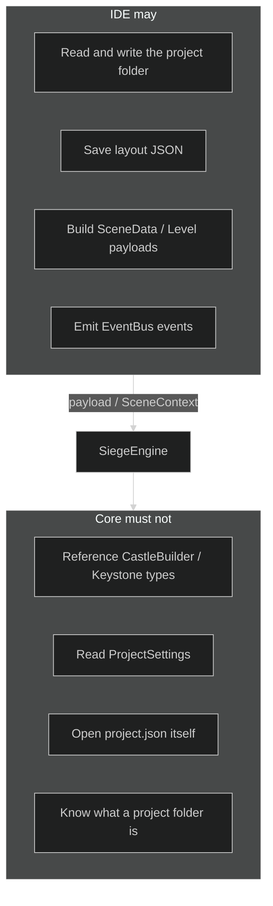
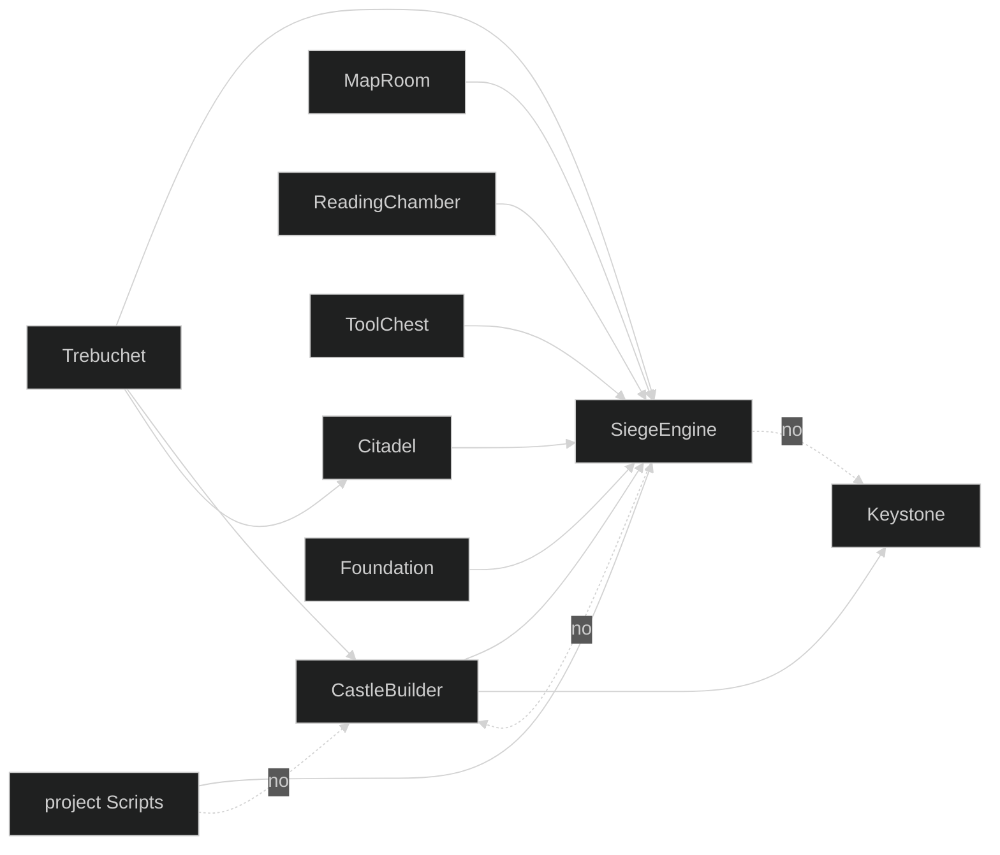
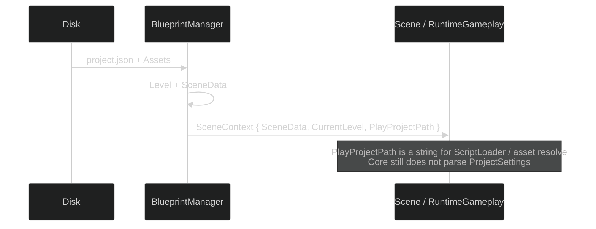

# Layer boundaries

The boundary is the thing that must not drift. This page is the rule sheet that [ARCHITECTURE](ARCHITECTURE.md) assumes.



---

## Who may know whom



Solid arrows are allowed references. Dashed "no" arrows are the wall.

IDE assemblies should not grow a web of references across the CastleBuilder wall when that wall already exists. Prefer a small contract in Core (`IHostedContent`, `SceneContext`, EventBus events) over panel A calling panel B's internals.

---

## Payloads, not paths

Core receives a game two ways:

1. **`SceneContext`** composed inside Core by the host (Trebuchet Play Host, Foundation, EditorScene).
2. **Serialized `Level` + `SceneData`** on that context.

`Level` is the in-memory source of truth: entities, terrain, skybox, environment, custom data. The folder on disk is persistence and Export only.



`PlayProjectPath` exists so ScriptLoader can find `Scripts/` and so the runtime can resolve asset paths. It is not permission for Core to load `Keystone.ProjectSettings`.

---

## Names

| Use | Do not use |
|---|---|
| `IHostedContent`, HUD, hosted view | A Core type named "ProjectPanel" |
| `SceneData.CustomSceneClass` | Hard-coded `ChessScene` in EditorScene |
| EventBus events | Static singletons that punch through layers |
| `GameSystem` in the project assembly | IDE panel logic compiled into SiegeEngine |

A panel contract in Core, if one is added, is named for **what it does** (content, HUD, hosted view), never for "project." The host supplies chrome. Game assemblies supply content.

---

## Cameras and movement

- `FlyCameraController` / `AngledOrthoCamera` are Core runtime cameras. They may run in Play.
- They are not `PlayerMovement`.
- Do not delete them from runtime to "keep editor cameras out."
- Do not wire the fly camera as the walk implementation.
- A custom controller (`[CustomPlayerController]`, `ControllerTypeName`) replaces movement only.

---

## EventBus hygiene

Subscribe in `Init` without `Unsubscribe` on dispose is a recurring blade-restore bug. If you touch a panel, unsubscribe first. Do not hunt panels that are not broken.

Protected events stay protected. Mods and clients do not publish them.

---

## Play / Export are one activation path

```text
Play Host  → SceneContext in-process → ActivateProjectScripts → SceneRegistry.Create
Foundation → payload → same activation
Export     → Foundation path + copy assets
```

Do not invent a third command line. Do not activate scripts in the editor with a different constructor than Play.

---

## Rendering boundary

- New world/camera writes go through `IRenderContext.SetConstants`.
- Do not add a DirectX or Vulkan backend from a docs or board-scene change.
- Terrain named-uniform GLSL is a floor.
- Custom scenes override `GetViewProjection` and write CBs. They do not call IDE camera types.
