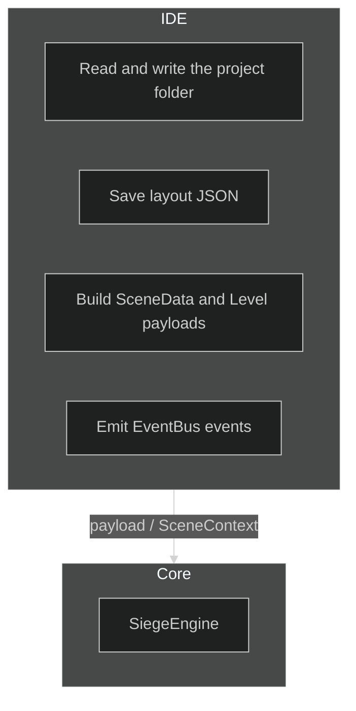
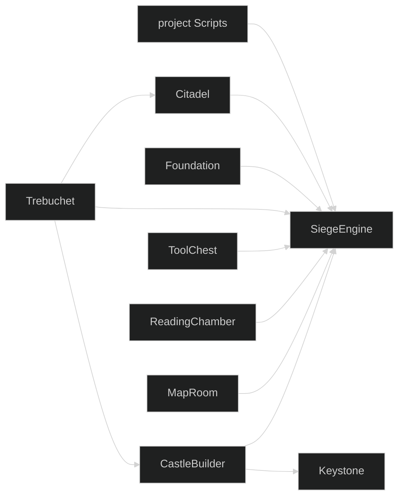
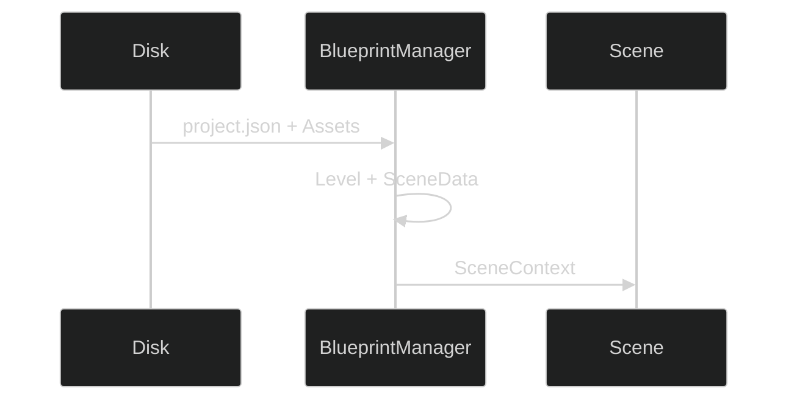

# Layer boundaries



Core does not reference CastleBuilder or Keystone types, does not read `ProjectSettings`, and does not parse `project.json`.

---

## References



IDE assemblies talk to SiegeEngine. SiegeEngine does not talk to CastleBuilder or Keystone. Project scripts talk to SiegeEngine only.

Prefer a contract in Core (`IHostedContent`, `SceneContext`, EventBus events) over one panel calling another panel's internals.

---

## Payloads

Core receives a game two ways:

1. A `SceneContext` built by Trebuchet, Foundation, or EditorScene.
2. Serialized `Level` and `SceneData` on that context.

`Level` is the in-memory source of truth: entities, terrain, skybox, environment, custom data. The folder on disk is persistence and Export.



`PlayProjectPath` lets ScriptLoader find `Scripts/` and lets the runtime resolve asset paths. It is not permission for Core to load `Keystone.ProjectSettings`.

---

## Names

| Use | Avoid |
|---|---|
| IHostedContent, HUD, hosted view | A Core type named ProjectPanel |
| SceneData.CustomSceneClass | Hard-coded ChessScene in EditorScene |
| EventBus events | Static singletons across layers |
| GameSystem in the project assembly | IDE panel logic compiled into SiegeEngine |

A panel contract in Core is named for what it does (content, HUD, hosted view). The host supplies chrome. Game assemblies supply content.

---

## Cameras and movement

- `FlyCameraController` and `AngledOrthoCamera` are Core runtime cameras. They run in Play.
- They are not `PlayerMovement`.
- A custom controller (`CustomPlayerController`, `ControllerTypeName`) replaces movement only.

---

## EventBus

Handlers that subscribe also unsubscribe on dispose. Events marked `ProtectedEvent` stay protected.

---

## Play and Export

```text
Play Host   SceneContext in-process  ActivateProjectScripts  SceneRegistry.Create
Foundation  payload                  same activation
Export      Foundation path + copy assets
```

Scripts activate with the same constructors in the editor and in Play.

---

## Rendering

World and camera writes go through `IRenderContext.SetConstants`. Custom scenes override `GetViewProjection` and write constant buffers. They do not call IDE camera types.
