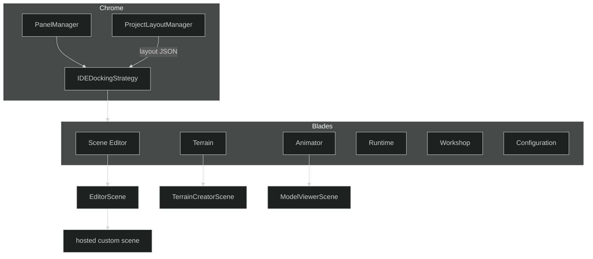
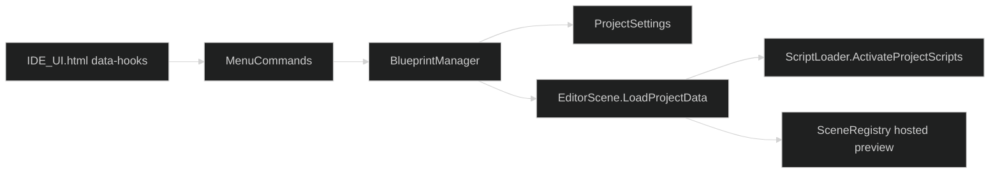
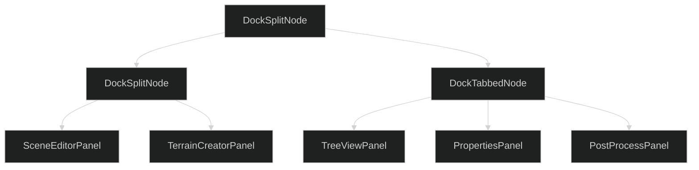
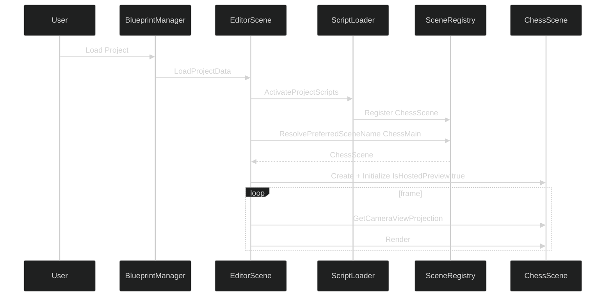
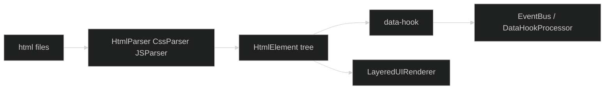

# IDE

Castle is SiegeEngine running in editor mode. The chrome is dockable panels, context blades, and HTML/CSS/JS bodies. The 3D view is a `Scene`.

---

## Assemblies

| Assembly | Folder | Job |
|---|---|---|
| CastleBuilder | Castle/IDE/CastleBuilder | EditorScene, BlueprintManager, MenuCommands, Scene Editor, Script Editor, Play Host |
| Keystone | Castle/IDE/Keystone | ProjectSettings, ProjectData, ProjectStateManager, ProjectLayoutManager, outliner, undo |
| MapRoom | Castle/IDE/MapRoom | Terrain creator, 2D creator |
| ReadingChamber | Castle/IDE/ReadingChamber | File selector, animation and asset viewer |
| ToolChest | Castle/IDE/ToolChest | Asset browser, properties, tree view, brushes, animation timeline and blend, console, lights, skybox, post-process, gizmos |

CastleBuilder talks to Keystone. Core does not.

---

## Docking

`IDEDockingStrategy` is a split / tab / float tree. Each leaf is a `BasePanel`. Layouts save per context (`layout.Scene Editor.json`, `layout.Terrain.json`) and restore when the blade changes.

Panels float. Pop-out windows are extra host surfaces.

`BasePanel` owns chrome (title, focus, resize), an HTML body, and optional 3D content (`RenderInnerContent` to `EditorScene.Render`).

Panel EventBus handlers unsubscribe on close.

---

## Scene Editor hosting

When resolve returns `RuntimeGameplay`, the editor shows the terrain and entity view, or an empty `GameScene` when the scene has no entities.

---

## Contexts

| Context | Panels | Scene |
|---|---|---|
| Scene Editor | SceneEditor, TreeView, Properties, PostProcess | EditorScene and optional hosted custom scene |
| Terrain | TerrainCreator, Brush, Properties | TerrainCreatorScene |
| Animator | Animation viewer, timeline, blend | ModelViewerScene |
| Runtime | Runtime / Play Host | in-process Play |
| Workshop | Workshop browser | none |
| Configuration | project settings | none |

A new panel is a `BasePanel`, an HTML body, a data-hook, and a docking slot.

---

## HTML / CSS / JS UI

The same UI stack draws the main menu, IDE chrome, and game HUD.

Hooks are namespace-qualified (`CastleBuilder.BlueprintManager.Load`). Mods override HTML. Game assemblies register hosted content.
