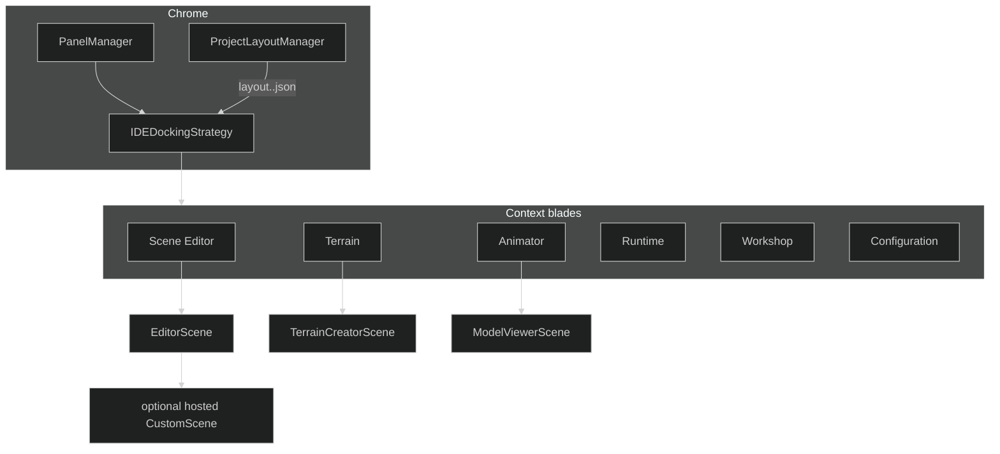
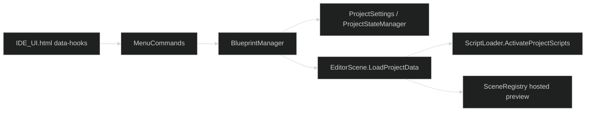
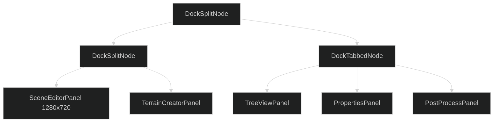
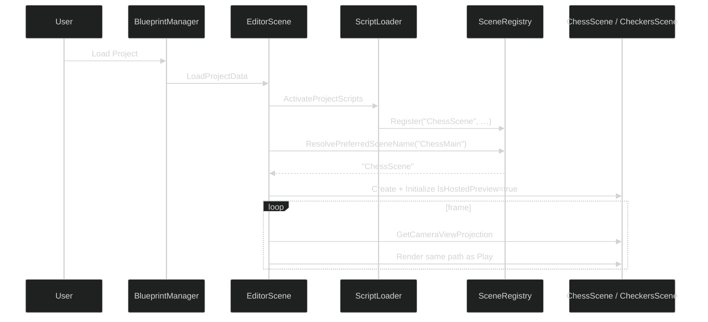
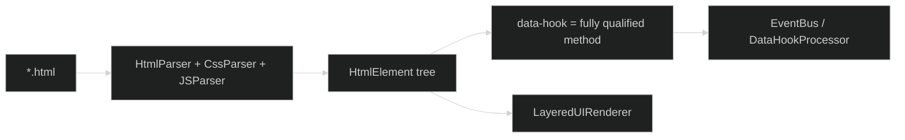

# IDE — CastleBuilder and the blades

Castle is SiegeEngine running in editor mode. The chrome is dockable panels, context blades, and HTML/CSS/JS bodies. The 3D view is a `Scene`.

---

## Assemblies

| Assembly | Folder | Job |
|---|---|---|
| `CastleBuilder` | `Castle/IDE/CastleBuilder` | EditorScene, BlueprintManager, MenuCommands, Scene Editor / Script Editor / Play Host / Runtime panels |
| `Keystone` | `Castle/IDE/Keystone` | `ProjectSettings`, `ProjectData`, `ProjectStateManager`, `ProjectLayoutManager`, outliner, undo |
| `MapRoom` | `Castle/IDE/MapRoom` | Terrain creator, 2D creator |
| `ReadingChamber` | `Castle/IDE/ReadingChamber` | File selector, animation / asset viewer |
| `ToolChest` | `Castle/IDE/ToolChest` | Asset browser, properties, tree view, brushes, animation timeline / blend, console, lights, skybox, post-process, gizmos |

CastleBuilder may talk to Keystone. Core may not.

---

## Docking

`IDEDockingStrategy` is a split / tab / float tree. Each leaf is a `BasePanel`. Layouts are saved per **context** (`layout.Scene Editor.json`, `layout.Terrain.json`, …) and restored when the blade changes.

Panels can float. Pop-out windows are additional host surfaces, not a second engine.

`BasePanel` owns:

- Chrome (title, focus, resize)
- An HTML body (`IDE_UI.html`, `SceneEditorUI.html`, …)
- Optional 3D content (`RenderInnerContent` → `EditorScene.Render`)

Subscribe EventBus in panel init; unsubscribe on close. Blade restore will otherwise stack handlers.

---

## Scene Editor hosting

If resolve returns `"RuntimeGameplay"`, the editor shows the classic terrain/entity view (or an empty `BasicGameScene` when the scene has no entities). That is why a board project with a broken constructor looks blank.

---

## Contexts and tools

| Context | Typical panels | Typical scene |
|---|---|---|
| Scene Editor | SceneEditor, TreeView, Properties, PostProcess | `EditorScene` ± hosted custom scene |
| Terrain | TerrainCreator, Brush, Properties | `TerrainCreatorScene` |
| Animator | Animation viewer, timeline, blend | `ModelViewerScene` |
| Runtime | Runtime / Play Host | in-process Play |
| Workshop | Workshop browser | none |
| Configuration | project settings | none |

Adding a panel does not require a new renderer. It requires a `BasePanel`, an HTML body, a data-hook, and a docking slot.

---

## HTML / CSS / JS UI

The same UI stack draws the main menu, IDE chrome, and game HUD.

Hooks are namespace-qualified (`CastleBuilder.BlueprintManager.Load`). Mods override HTML. Game assemblies register hosted content instead of reaching into CastleBuilder types.

---

## What the IDE must not become

- A second renderer
- A hard-coded list of game types (`if chess … else if checkers …`)
- A place that runs AI or gameplay input inside a hosted preview
- A consumer of `SetMatrix4("uView")` for the world camera — that is Core's CB contract
