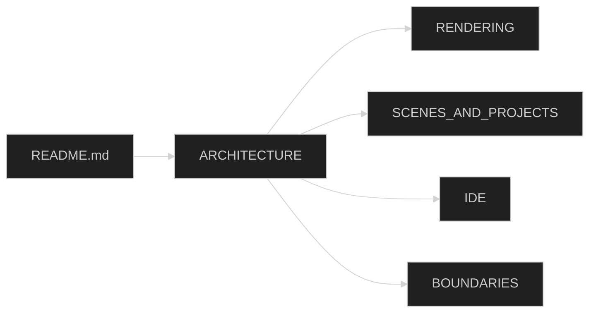

# Castle docs

| Page | Summary |
|---|---|
| [ARCHITECTURE.md](ARCHITECTURE.md) | Layers, self-hosting, folder map, frame loop |
| [RENDERING.md](RENDERING.md) | IRenderContext, constant buffers, OpenGL |
| [SCENES_AND_PROJECTS.md](SCENES_AND_PROJECTS.md) | SceneRegistry, ScriptLoader, hosted preview, Play, Export |
| [IDE.md](IDE.md) | Blades, docking, CastleBuilder / Keystone / ToolChest |
| [BOUNDARIES.md](BOUNDARIES.md) | Core, IDE, Server, project scripts |

