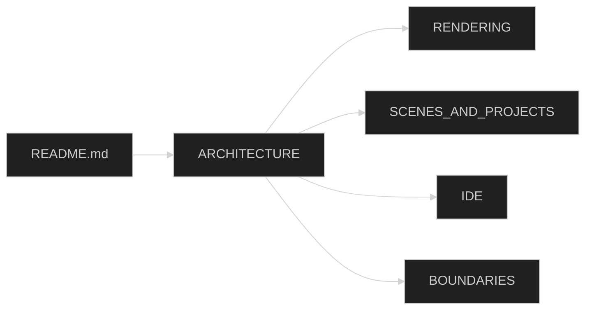

# Castle docs

These pages describe the repository as it is, not the older stub-module picture.

| Page | Summary |
|---|---|
| [ARCHITECTURE.md](ARCHITECTURE.md) | Four concerns, self-hosting runtime, folder map, frame loop |
| [RENDERING.md](RENDERING.md) | `IRenderContext`, constant buffers, OpenGL-only, named-uniform floors |
| [SCENES_AND_PROJECTS.md](SCENES_AND_PROJECTS.md) | `SceneRegistry`, `ScriptLoader`, hosted preview vs Play, examples |
| [IDE.md](IDE.md) | Blades, docking, CastleBuilder / Keystone / ToolChest |
| [BOUNDARIES.md](BOUNDARIES.md) | What Core may not know; Play / Export activation |

The root [README](../README.md) keeps the original overview, security, modularity, and subsystem mermaid diagrams, with notes where SandboxScene / named uniforms / stub DLLs are historical.

