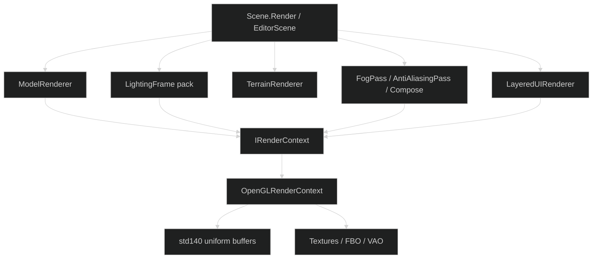
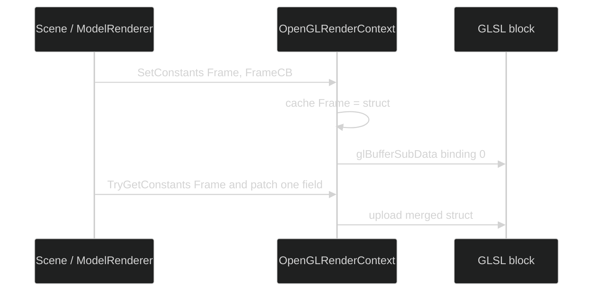
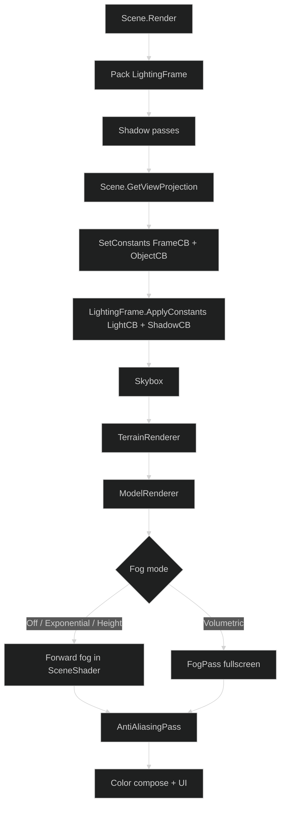
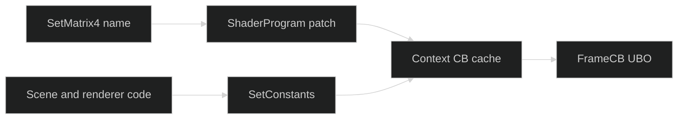

# Rendering

SiegeEngine draws through `IRenderContext`. The implemented backend is OpenGL (`OpenGLRenderContext`).



---

## Constant buffers

A constant buffer (CB) is a std140 uniform block. Shaders declare blocks such as `FrameCB`. C# uploads a matching sequential struct with `SetConstants`.

```glsl
layout(std140) uniform FrameCB {
    mat4 View;
    mat4 Projection;
    vec4 ViewPos;
    float Time;
    int HasTexture;
    float PadFrame0;
    float PadFrame1;
};
```

```csharp
_renderContext.SetConstants(ConstantSlot.Frame, new FrameCB {
    View = view,
    Projection = projection
});
```

`OpenGLRenderContext` keeps a last-write cache per slot. A later writer calls `TryGetConstants` and merges fields instead of zeroing siblings (`ViewPos`, bone flags, previous matrices, cascade matrices).



---

## Slots

Defined in `SiegeEngine/Core/GPU/Shaders/ConstantBuffers.cs`. C# layout matches the GLSL std140 block. Padding is part of the contract.

| Slot | Writers | Contents |
|---|---|---|
| Frame | Scene, ModelRenderer, custom scenes | View, Projection, ViewPos, Time |
| Object | ModelRenderer, custom scenes | Model, NormalMatrix |
| Skin | ModelRenderer | Bone matrices, HasBones |
| Material | ModelRenderer | Colors, flags, UV |
| Light | LightingFrame | Sun, ambient, points, spots, fog scalars |
| Shadow | LightingFrame | CascadeVP0-3, splits, atlas size, point-shadow flags |
| Ui | UI path | Ortho projection, color |
| Post | FogPass, AntiAliasingPass | PrevView, PrevProjection, InvView, InvProjection, AA / bloom / exposure |

Samplers are named uniforms (`uAlbedoMap`, `uShadowAtlas`, `uDepth`, `uColor`). Textures are not constant buffers.

---

## World frame



`EditorScene` calls `Scene.Render` on a hosted custom scene.

---

## Custom scene cameras

A `CustomSceneEntry` scene that needs a board or orthographic view:

1. Overrides `GetViewProjection` so AA, compose, and shadows use the same matrices.
2. Writes those matrices with `SetConstants`.

Chess and checkers use look-at `(4, 4, 12)` to `(4, 4, 0)`, up `(0, 1, 0)`, ortho half-extent `5.5`.

`ShaderProgram.SetMatrix4` patches the cached constant buffer when the named uniform is absent. New world and camera code calls `SetConstants`.



---

## Named uniforms that remain

| Path | Uniforms |
|---|---|
| TerrainRenderer GLSL | `uView`, `uProjection`, `uModel`, `uCascadeVP`, light uniforms |
| LightingFrame.ApplyTo | Named light and shadow uniforms used by terrain |
| SMAA / FXAA / copy | Sampler and resolution uniforms |
| UI / text / sprite / line / debug | Their own shaders |

Volumetric fog: `CascadeVPAt` is defined in both the fullscreen vertex shader and the volumetric fragment shader. GLSL stages do not share functions. `FogPass` compiles that fragment when fog mode is Volumetric.

---

## File map

```text
SiegeEngine/Core/GPU/
  ContextManagement/   IRenderContext, OpenGLRenderContext
  Shaders/             ConstantBuffers, ShaderProgram, SceneShader, AnimationShader
  Renderers/           ModelRenderer, TerrainRenderer, LayeredUIRenderer
  Lighting/            LightingFrame, FogPass, FogShaders
  PostProcess/         AntiAliasingPass
  TextureLoader.cs
  VertexBuffer.cs
```
