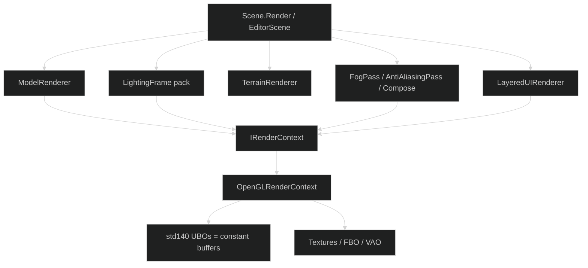
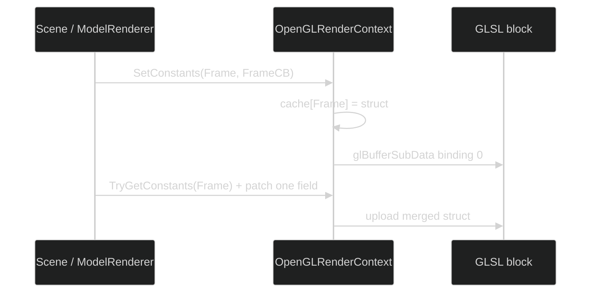
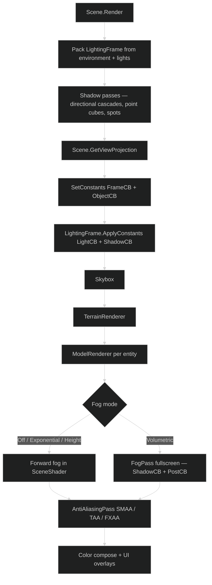
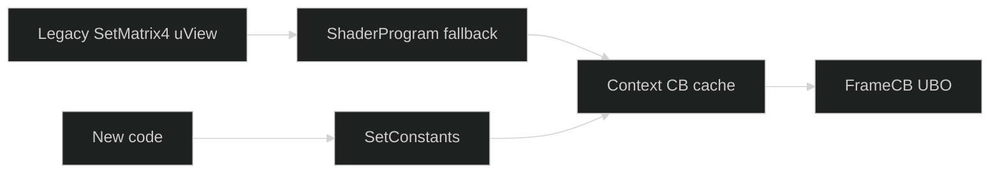

# Rendering

SiegeEngine draws through **`IRenderContext`**. The only implemented backend is **OpenGL** (`OpenGLRenderContext`). Settings may list DirectX 11/12 as names. Those backends are not written. Do not add HLSL or SPIR-V in a drive-by change.



---

## Why constant buffers

A **constant buffer (CB)** is a std140 uniform block. DirectX uses the same idea under that name; OpenGL calls it a uniform buffer object. SiegeEngine uses the DX name because `IRenderContext` is meant to grow a second backend later against the **existing** interface.

Shaders no longer declare `uniform mat4 uView`. They declare:

```glsl
layout(std140) uniform FrameCB {
    mat4 View;
    mat4 Projection;
    vec4 ViewPos;
    float Time;
    int HasTexture;
    float PadFrame0;
    float PadFrame1;
};
```

C# uploads a matching sequential struct:

```csharp
_renderContext.SetConstants(ConstantSlot.Frame, new FrameCB {
    View = view,
    Projection = projection
});
```

`OpenGLRenderContext` keeps a last-write cache per slot so a later writer can `TryGetConstants<T>` and merge instead of zeroing sibling fields (`ViewPos`, `HasBones`, `PrevView`, cascade matrices, …).



---

## Slots

Defined in `SiegeEngine/Core/GPU/Shaders/ConstantBuffers.cs`. Layout must match the GLSL `std140` block. Padding is load-bearing.

| Slot | Typical writers | Contents |
|---|---|---|
| `Frame` | Scene, ModelRenderer, custom scenes | View, Projection, ViewPos, Time |
| `Object` | ModelRenderer, custom scenes | Model, NormalMatrix |
| `Skin` | ModelRenderer | Bone matrices, HasBones |
| `Material` | ModelRenderer | Colors, flags, UV |
| `Light` | LightingFrame | Sun, ambient, points, spots, fog scalars |
| `Shadow` | LightingFrame | CascadeVP0–3, splits, atlas size, point-shadow flags |
| `Ui` | UI path | Ortho projection, color |
| `Post` | FogPass, AntiAliasingPass | PrevView/PrevProjection, InvView/InvProjection, AA/bloom/exposure |

Samplers stay named uniforms (`uAlbedoMap`, `uShadowAtlas`, `uDepth`, `uColor`). Textures are not CBs.

---

## World frame



`EditorScene` used to pack a different frame and call `RenderWorldOnly`, which skipped gameplay prepare. It now calls the same `Scene.Render` Play uses when a custom scene is hosted.

---

## Custom scenes and cameras

A `[CustomSceneEntry]` scene that needs a board / isometric / ortho view **must**:

1. Override `GetViewProjection` so AA / compose / shadows see the same matrices.
2. Write those matrices with `SetConstants`, not `SetMatrix4("uView")`.

Chess and checkers:

```text
look-at  (4, 4, 12) → (4, 4, 0)
up       (0, 1, 0)
ortho    half = 5.5, aspect-correct width
```

`ShaderProgram.SetMatrix4("uView", …)` still exists as a **fallback**. If the named uniform is gone it patches the cached `FrameCB.View`. That keeps old callers drawing. It is not the contract for new code. New code calls `SetConstants`.



---

## What is still named-uniform

Allowed floors — do not "clean up" in the same change that touches a board scene:

| Path | State |
|---|---|
| `TerrainRenderer` GLSL | `uView` / `uProjection` / `uModel` / `uCascadeVP[4]` / light uniforms. Terrain editor floor. |
| `LightingFrame.ApplyTo(shader)` | Named light/shadow spray. Terrain still calls it. World path uses `ApplyConstants`. |
| SMAA / FXAA / copy | Sampler + resolution uniforms. Correct. |
| UI / text / sprite / line / debug | Own small shaders, named uniforms. Out of scope for the world CB pass. |
| ModelRenderer leftover `SetMatrix4("uView")` after `SetConstants` | Harmless while the fallback lives; strip only after a Play pass confirms the world path. |

Volumetric fog: `CascadeVPAt` must be defined **in the fragment shader**. GLSL stages do not share functions. The vertex helper is invisible to `FogShaders.VolumetricFragment`. Switching fog type to Volumetric constructs `FogPass` and compiles that fragment — a missing helper is a hard launcher crash.

---

## Interface surface for a future backend

`IRenderContext` already has the portable calls a DirectX backend would implement: pipelines, buffers, `SetConstants<T>`, draw. A later chat can add that backend against the existing interface.

Do **not** start it here. Do **not** write HLSL. Do **not** invent a second shader compiler. OpenGL-through-`IRenderContext` is the current production path.

---

## File map

```text
SiegeEngine/Core/GPU/
  ContextManagement/   IRenderContext, OpenGLRenderContext
  Shaders/             ConstantBuffers, ShaderProgram, SceneShader, AnimationShader, …
  Renderers/           ModelRenderer, TerrainRenderer, LayeredUIRenderer, …
  Lighting/            LightingFrame, FogPass, FogShaders, shadow maps
  PostProcess/         AntiAliasingPass, compose
  TextureLoader.cs
  VertexBuffer.cs
```
