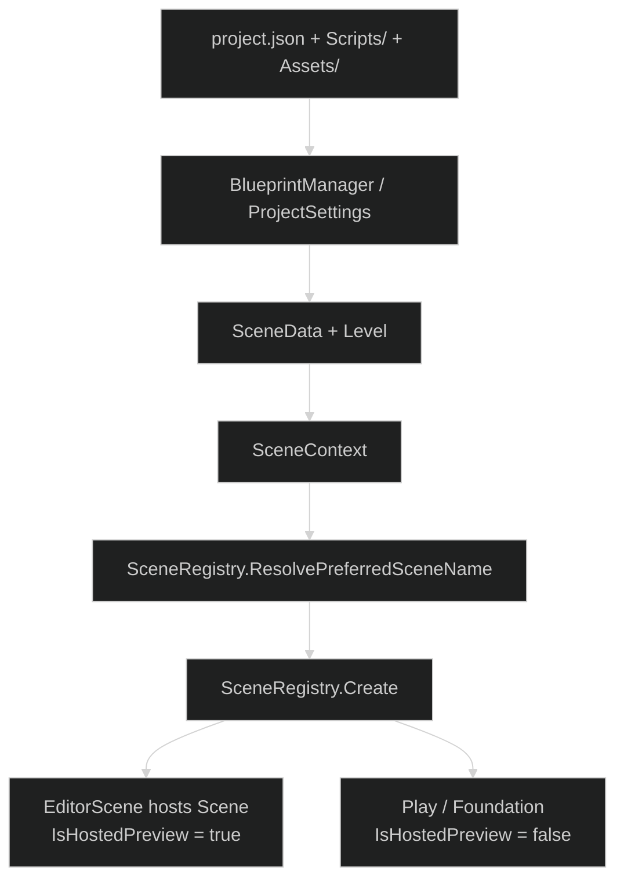
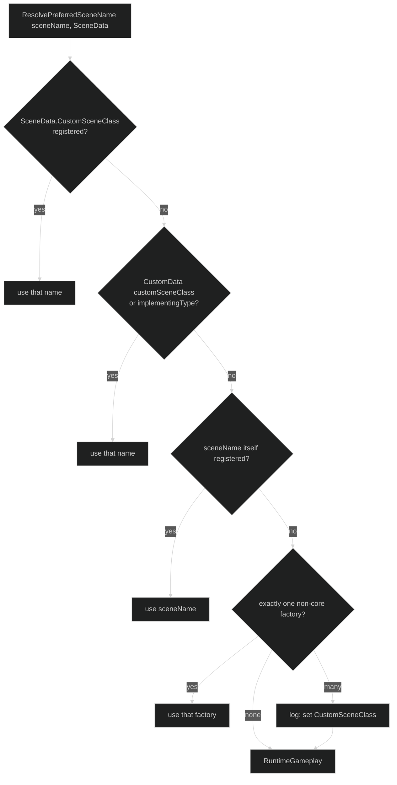
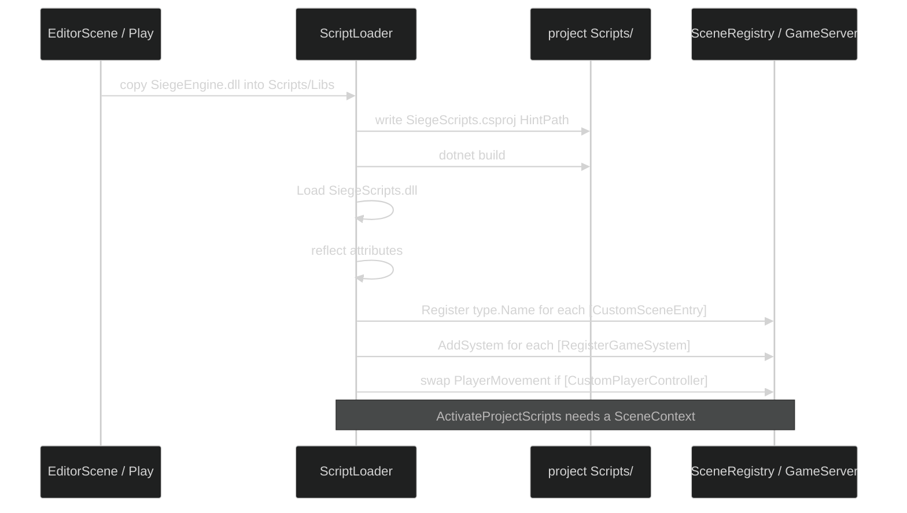
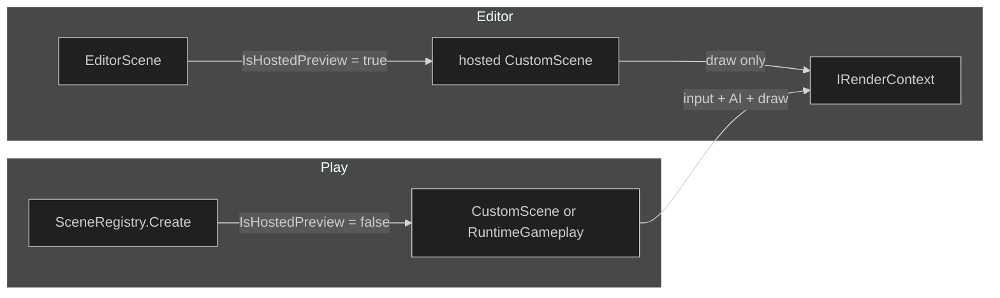
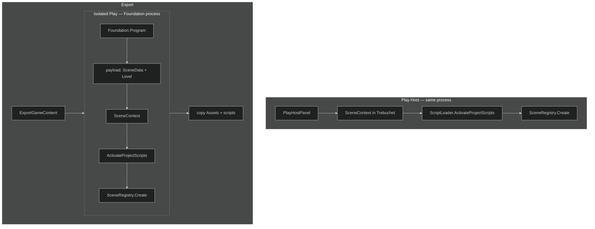

# Scenes, Play, and project scripts

Core does not know what a project is. It knows `Scene`, `SceneContext`, `SceneData`, and `Level`. The IDE serializes a project folder into those types. Play and the Scene Editor consume the same objects.



---

## Scene types in Core

```mermaid
%%{init: {'theme':'dark'}}%%
classDiagram
  class Scene {
    <<abstract>>
    +Initialize(w,h)
    +Update(dt)
    +Render(entities)
    #GetViewProjection()
    #RenderContent()
  }
  Scene <|-- GameScene
  Scene <|-- RuntimeGameplayScene
  Scene <|-- ModelViewerScene
  Scene <|-- TerrainScene
  Scene <|-- EditorScene
  Scene <|-- CustomEntry["project [CustomSceneEntry]<br/>ChessScene / CheckersScene"]
```

| Type | Role |
|---|---|
| `Scene` | Abstract frame: camera, lighting pack, world, fog, AA, overlays |
| `RuntimeGameplayScene` | Classic Play/Export — terrain + entities + player |
| `GameScene` / `BasicGameScene` | Lightweight gameplay host used next to a hosted custom scene |
| `ModelViewerScene` | Asset / animation viewer |
| `TerrainScene` | Runtime terrain |
| `EditorScene` | IDE wrapper. Can host a child custom scene for live preview |
| Project `ChessScene`, `CheckersScene`, … | `[CustomSceneEntry]` types compiled by `ScriptLoader` |

`SandboxScene` in older README diagrams is historical. It is not the primary path.

---

## SceneRegistry

Core registers two names at startup:

- `"Sandbox"`
- `"RuntimeGameplay"` → `RuntimeGameplayScene`

Project assemblies add more names at `ScriptLoader.ActivateProjectScripts`.



`EditorScene` hosts a custom scene only when the resolved name is **not** `"RuntimeGameplay"`. That is why a board game that never registers `[CustomSceneEntry]` looks like an empty Scene Editor.

---

## ScriptLoader



Attributes (defined next to `ScriptLoader`):

| Attribute | Meaning |
|---|---|
| `[CustomSceneEntry]` | `Scene` subclass. Registered under `type.Name` |
| `[RegisterGameSystem]` | Constructed with `SceneContext` services, added to the server |
| `[CustomPlayerController]` | Replaces `PlayerMovement` when no explicit `ControllerTypeName` |
| `[RegisterHostedContent]` | HUD / content; host supplies chrome |

A `[RegisterGameSystem]` that remaps `"RuntimeGameplay"` (the chess/checkers `*RuntimeHook`) is the **Play compatibility** path. It is slightly blunt — it overwrites a core factory — but it is how a project takes over classic Play without the IDE hard-coding `ChessScene`. The cleaner long-term field is `SceneData.customSceneClass`.

---

## Hosted preview vs Play



Rules a custom scene must follow or the editor will not look like Play:

1. `public Scene(SceneContext context) : base(context)` — not the five-argument ctor alone.
2. Read `context.IsHostedPreview`. If true: rebuild meshes, draw, **do not** install window callbacks, **do not** run AI, **do not** consume clicks.
3. Poll `IControlContext` on Play. The host owns the window.
4. Override `GetViewProjection` and write `FrameCB` / `ObjectCB` via `SetConstants`.
5. Unsubscribe EventBus handlers on dispose. Subscribe-without-unsubscribe is a blade-restore leak.

Chess already does this. Checkers must match it or EditorScene logs `Failed to host custom scene` and falls back to an empty `BasicGameScene`.

---

## Play and Export



Those two Play paths are supposed to activate the **same** scripts, the **same** controller, and the **same** scene. Export is that path plus files. It is not a third command line.

---

## Project file

```json
{
  "Name": "chess",
  "Type": "2D",
  "CameraType": "AngledOrtho",
  "LastOpenedScene": "ChessMain",
  "LastContext": "Scene Editor",
  "Scenes": {
    "ChessMain": {
      "name": "ChessMain",
      "sceneType": "Gameplay",
      "customSceneClass": "ChessScene",
      "settings": { "cameraMode": "Ortho" },
      "environment": { },
      "entities": []
    }
  }
}
```

Notes:

- `Type` / `CameraType` / `cameraMode` describe intent. They do not currently swap an engine camera by themselves. A board game still overrides `GetViewProjection`.
- `customSceneClass` is the explicit hosted-scene name. Fill it in. Do not rely on the single-factory heuristic once a project has more than one `[CustomSceneEntry]`.
- `entities: []` is normal for a custom scene that draws its own board. The Scene Editor is not empty because of that list; it is empty only if hosting failed.

---

## Examples

Repo: `ireakhavok/Siege_Engine_Example_Projects`.

| Project | Scene class | Hook | Typical camera |
|---|---|---|---|
| `chess` | `ChessScene` | `ChessRuntimeHook` remaps RuntimeGameplay | Ortho look-at board |
| `checkers` | `CheckersScene` | `CheckersRuntimeHook` | Same contract as chess |
| `checkers_v2` | `CheckersScene` | same hook expected | Same contract as chess |
| `save3` | none (classic) | inventory HUD + custom controller | RuntimeGameplay + terrain |

After changing scripts, delete `Scripts/Libs/SiegeScripts.dll` and `RuntimeTemp/SiegeScripts.dll` so `ScriptLoader` rebuilds.
