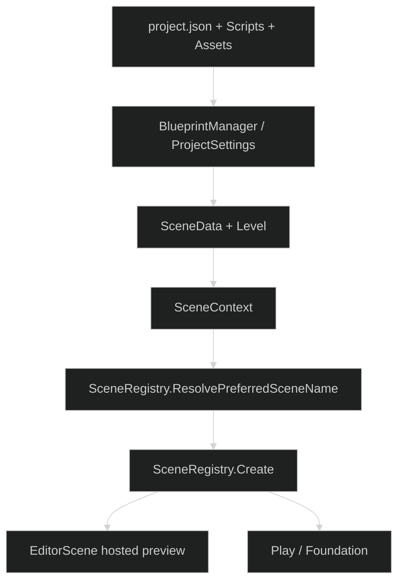
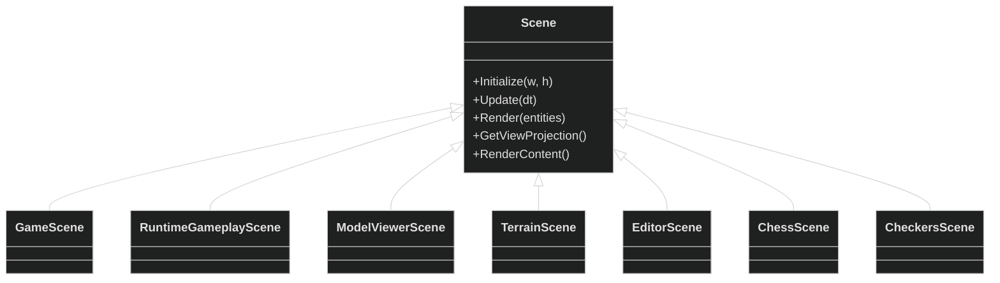
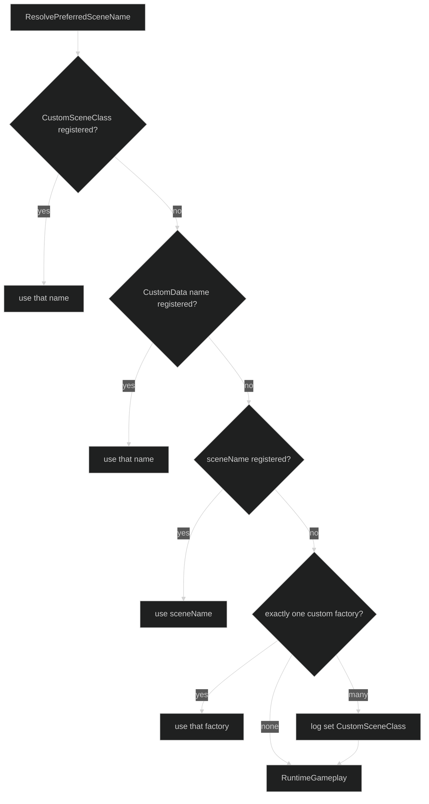
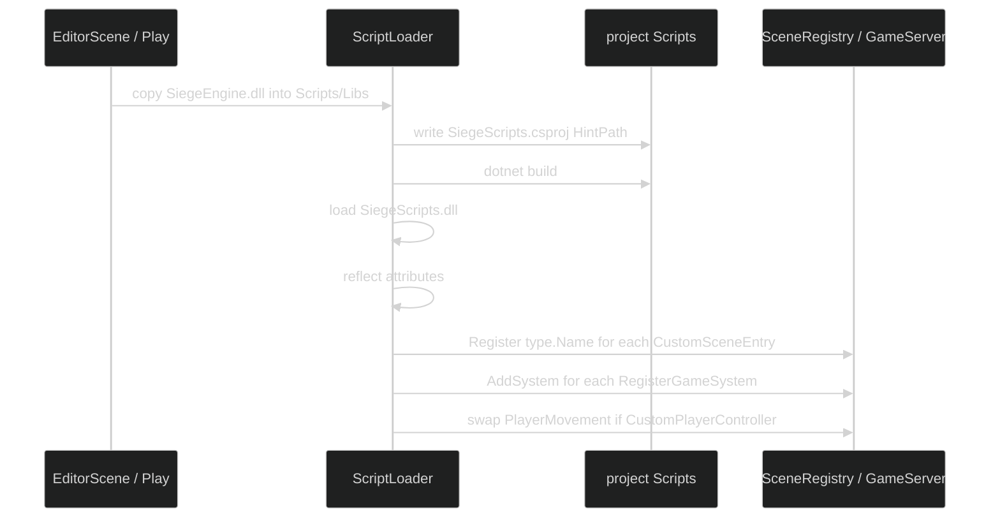
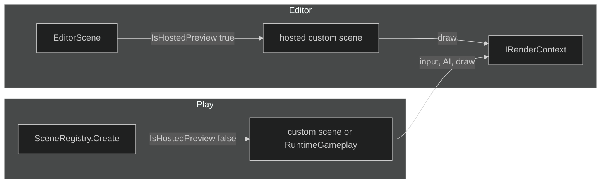
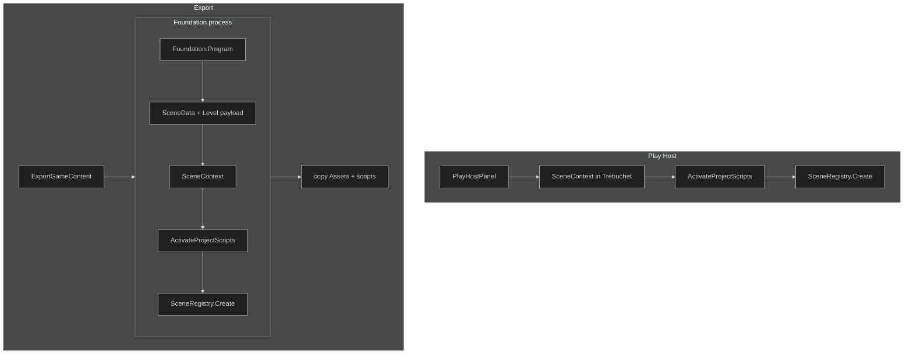

# Scenes, Play, and project scripts

Core does not know what a project is. It knows `Scene`, `SceneContext`, `SceneData`, and `Level`. The IDE serializes a project folder into those types. Play and the Scene Editor consume the same objects.



---

## Scene types



| Type | Role |
|---|---|
| Scene | Frame: camera, lighting pack, world, fog, AA, overlays |
| RuntimeGameplayScene | Play / Export for terrain and entity levels |
| GameScene | Gameplay host used next to a hosted custom scene |
| ModelViewerScene | Asset and animation viewer |
| TerrainScene | Runtime terrain |
| EditorScene | IDE wrapper; hosts a child scene for live preview |
| ChessScene, CheckersScene | Project scenes registered by ScriptLoader |

---

## SceneRegistry

Core registers two names at startup:

- `Sandbox`
- `RuntimeGameplay` maps to `RuntimeGameplayScene`

Project assemblies add more names in `ScriptLoader.ActivateProjectScripts`.



`EditorScene` hosts a custom scene when the resolved name is not `RuntimeGameplay`.

---

## ScriptLoader



| Attribute | Meaning |
|---|---|
| CustomSceneEntry | Scene subclass, registered under `type.Name` |
| RegisterGameSystem | Constructed with SceneContext services, added to the server |
| CustomPlayerController | Replaces PlayerMovement when ControllerTypeName is empty |
| RegisterHostedContent | HUD / content; host supplies chrome |

A `RegisterGameSystem` hook may remap `RuntimeGameplay` so Play constructs the project scene.

---

## Hosted preview and Play



A custom scene:

1. Uses `public SceneName(SceneContext context) : base(context)`.
2. Reads `context.IsHostedPreview`. When true it rebuilds meshes and draws; it does not install window callbacks, run AI, or consume clicks.
3. Polls `IControlContext` during Play. The host owns the window.
4. Overrides `GetViewProjection` and writes `FrameCB` / `ObjectCB` via `SetConstants`.
5. Unsubscribes EventBus handlers on dispose.

---

## Play and Export



Play Host and Foundation activate the same scripts, controller, and scene. Export is that path plus files.

---

## Project file

```json
{
  "Name": "chess",
  "Type": "2D",
  "CameraType": "AngledOrtho",
  "LastOpenedScene": "ChessMain",
  "LastContext": "Scene Editor",
  "Scenes": {
    "ChessMain": {
      "name": "ChessMain",
      "sceneType": "Gameplay",
      "customSceneClass": "ChessScene",
      "settings": { "cameraMode": "Ortho" },
      "environment": {},
      "entities": []
    }
  }
}
```

`Type`, `CameraType`, and `cameraMode` describe the project. A board game also overrides `GetViewProjection`.

`customSceneClass` is the hosted-scene name.

`entities: []` is normal for a custom scene that draws its own board.

---

## Examples

Repo: `ireakhavok/Siege_Engine_Example_Projects`.

| Project | Scene class | Runtime hook | Camera |
|---|---|---|---|
| chess | ChessScene | ChessRuntimeHook remaps RuntimeGameplay | Ortho board look-at |
| checkers | CheckersScene | CheckersRuntimeHook | Ortho board look-at |
| checkers_v2 | CheckersScene | CheckersRuntimeHook | Ortho board look-at |
| save3 | none | inventory HUD + custom controller | RuntimeGameplay + terrain |
